.. _h7f638084255365d7838781f4d19c78:

Esempio di inserimento contenuti, classe per classe
***************************************************

In questa sezione vengono presentate le modalità di inserimento per le diverse tipologie di contenuto. Rimane un concetto di fondo: quando si scrivono i contenuti bisogna sempre tenere presente che si stanno scrivendo per i cittadini, persone che hanno conoscenza limitata o assente di come funziona internamente la Pubblica Amministrazione. I principi fondamentali da seguire sono quindi quelli della semplicità e chiarezza. 

Semplicità perché non ha senso fornire ad un utente informazioni che non gli siano utili, Chiarezza perché le informazioni devono essere il più possibile comprensibili.

Quando si scrive, non bisogna dare nulla per scontato.

.. _h4206f375449d2593c122327335225:

Servizi
=======

.. _h378011b2d106d321a287961616d4e54:

Servizio pubblico
-----------------

Scheda di presentazione del servizio ai cittadini. Per servizio pubblico si intende qualsiasi atto obbligatorio o discrezionale espletato da una pubblica amministrazione (o per conto di una pubblica amministrazione) nei confronti di cittadini, imprese/professionisti. 

Un servizio pubblico può essere erogato online oppure in modalità tradizionale (allo sportello). La descrizione da inserire qui serve all’utente per comprendere esattamente dove deve recarsi, cosa deve fare, quando, di documentazione deve disporre e cosa deve aspettarsi una volta terminata la procedura.

Per creare un nuovo Servizio Pubblico, è necessario:

#. Navigare nel contenitore dei Servizi

#. Dalla barra degli strumenti, selezionare la voce “Servizio pubblico”, per poi fare click sul pulsante “Crea”.

 \ |IMG1|\ 

Si aprirà l’interfaccia di creazione di un nuovo servizio. La compilazione è guidata, nel senso che per ogni attributo viene presentata una descrizione che spiega cosa va inserito.

Gli attributi da compilarei sono suddivisi in “Contenuti principali” (1) e “Meta” (2). 

\ |IMG2|\ 

\ |STYLE0|\ 

Viene di seguito descritto l’inserimento dati per ognuno degli attributi, soffermandosi su quelli che presentano una particolare complessità.

.. _h4b15344b65d7a535a3b1c66654c5458:

Nome del servizio (obbligatorio)
~~~~~~~~~~~~~~~~~~~~~~~~~~~~~~~~

Il nome del Servizio deve essere facilmente comprensibile dai cittadini. Ad esempio, il Servizio di raccolta differenziata si chiamerà "Raccolta differenziata", il Servizio di iscrizione all'asilo nido si chiamerà "Iscrizione asilo nido".  Il nome del servizio dovrebbe richiamare il fabbisogno che l’utente vuole soddisfare quando cerca informazioni sul sito.

Questo attributo ha un vincolo in termini di lunghezza, impostato a un massimo di 60 caratteri spazi inclusi.

.. _h2c2d6c5144172367851253162f5b11:

Titolo alternativo/Sottotitolo
~~~~~~~~~~~~~~~~~~~~~~~~~~~~~~

Se il servizio ha un nome che lo identifica in modo informale, può essere specificato in questo attributo. Ad esempio il Servizio "Sistema Unico di Segnalazioni" potrebbe avere come sottotitolo/titolo alternativo "IoSegnalo".

.. _h395c4e6e2c3c285e577369434622256:

Immagine
~~~~~~~~

Un’immagine identificativa del servizio. L’interfaccia di inserimento è quella vista nella descrizione degli attributi di tipo “Relazioni con immagini”. 

\ |IMG3|\ 

L’attributo permette di selezionare un’immagine tra quelle già caricate a sistema, oppure creare una nuova immagine, o caricare velocemente un file (di tipo immagine).

.. _h497a776651566c715793d445b602674:

Descrizione breve
~~~~~~~~~~~~~~~~~

Una sintetica descrizione del Servizio, lunga al massimo 160 caratteri, scritta utilizzando un linguaggio semplice che possa aiutare qualsiasi utente a identificare con chiarezza il Servizio. Non utilizzare un linguaggio ricco di riferimenti normativi. Questo è un attributo di tipo “Testo formattato”, per cui è possibile inserire anche grassetti, link, e così via.

.. _h506d5e5c2d62733a61506b1516162b2e:

Descrizione completa
~~~~~~~~~~~~~~~~~~~~

La descrizione estesa del Servizio, che spiega nel dettaglio di cosa si tratta.

.. _h5227777b7879636d583c649223a1c:

Tipologia del servizio (obbligatorio)
~~~~~~~~~~~~~~~~~~~~~~~~~~~~~~~~~~~~~

Il tipo di servizio deve essere selezionato tra le voci definite in una delle tassonomie. La tipologia scelta incide sulla navigazione: in visualizzazione, scegliendo una certa tipologia di servizio, verranno visualizzato i servizi appartenenti a quella tipologia.

\ |IMG4|\ 

.. _h70634d5851d403b69675243215d256a:

Parole chiave
~~~~~~~~~~~~~

una parola chiave o un’etichetta che descrive il servizio. Idealmente serve per collegare il contenuto del Servizio ad un concetto che sia comprensibile al cittadino.

\ |IMG5|\ 

.. _h7d117d4c5e4a664fe7b2104a507b25:

Tema del servizio
~~~~~~~~~~~~~~~~~

Questo attributo server per classificare il servizio secondo le tematiche definite a livello europeo. 

\ |IMG6|\ 

.. _h727d712b287a282d5b432b2e7d407877:

Stato del servizio - Motivo dello stato
~~~~~~~~~~~~~~~~~~~~~~~~~~~~~~~~~~~~~~~

Rappresenta l’effettiva fruibilità del servizio, che potrebbe essere temporaneamente non attivo. In questo caso va compilato l’attributo “Motivo dello stato”, in modo da informare i cittadini del motivo per cui il Servizio non è disponibile.

\ |IMG7|\ 

.. _hf2b59373efb6e311420c45424478:

Lingua
~~~~~~

Va indicata qui la lingua nella quale il servizio è erogato, sia che si tratti di un servizio online, che erogato allo sportello o al telefono.

\ |IMG8|\ 

.. _h745c121e5a67645725403839605b5d26:

Argomento (obbligatorio)
~~~~~~~~~~~~~~~~~~~~~~~~

Tutte le tipologie di contenuto hanno un attributo “argomento”. Gli argomenti consentono la navigazione trasversale, e aggregano contenuti di ogni tipo. Indicando l’argomento per un servizio, il servizio comparirà nell’aggregazione di contenuti di quello specifico argomento.

\ |IMG9|\ 

.. _h2045aa92a5e2c272b345702c632f:

Descrizione dei destinatari
~~~~~~~~~~~~~~~~~~~~~~~~~~~

Chi sono i principali destinatari del servizio? Ad esempio “cittadini maggiorenni”.

\ |IMG10|\ 

.. _h412f1043567f64135d1938674c4a84a:

Chi può fare domanda
~~~~~~~~~~~~~~~~~~~~

Questo attributo serve per specificare eventuali restrizioni per la presentazione della domanda di erogazione del servizio. \ |IMG11|\ 

Differisce dal precedente per due motivi: è più specifico, e riguarda chi presenta la domanda, che non è necessariamente il destinatario di un servizio (ad esempio, il destinatario potrebbe essere un minore, ma la domanda va presentata da uno dei genitori o da un tutore)

.. _h61111f785f515a163e265a6d50b7156:

Copertura geografica
~~~~~~~~~~~~~~~~~~~~

Un servizio può avere un territorio di riferimento, ovvero. Questo attributo consente di specificare uno o più comuni, scegliendo dalla lista dei comuni italiani. Un servizio potrebbe essere collegato ad un solo comune, ma anche a più comuni (si pensi a servizi sovracomunali).

\ |IMG12|\ 

.. _h231d368496373671a56374935162724:

Come si fa (obbligatorio)
~~~~~~~~~~~~~~~~~~~~~~~~~

Una descrizione della procedura da seguire per usufruire del servizio: l’idea è quella di comunicare al cittadino cosa egli debba fare.

\ |IMG13|\ 

.. _h607d674e6f2a4834743a2d554f457e10:

Cosa si ottiene
~~~~~~~~~~~~~~~

Se il servizio prevede l’emissione di qualcosa al termine, inserire qui la descrizione Ad esempio una descrizione di un certificato, o della Carta d’identità. L’idea è di rendere il cittadino consapevole di cosa debba aspettarsi.

\ |IMG14|\ 

È possibile scegliere tra gli “output del servizio” già presenti a sistema (nel caso di servizi che prevedono lo stesso output, ad esempio “Rilascio carta d’identità” e “Rinnovo carta d’identità”), ma anche di crearne uno nuovo (caso più probabile). Il click  su “Crea output del servizio”.

 

\ |IMG15|\ 

Quando si crea un nuovo output del servizio, è necessario compilare gli attributi obbligatori, che sono il Nome e la tipologia di output. Una volta compilati, cliccando su “Salva”, il nuovo output è visualizzato:

\ |IMG16|\ 

Da qui è possibile, cliccando sul pulsante con l’icona della matita, modificare l’output, aggiungendo le info che in prima battuta non erano state inserite.

.. _h6978527f5e3058444a5d44743d1b1e38:

Canali digitali
~~~~~~~~~~~~~~~

Serve per specificare quali sono i canali attraverso i quali è possibile attivare un servizio. Il sistema consente di scegliere tra canali esistenti o di creare un nuovo canale. 

\ |IMG17|\ 

Il canale può essere un numero di telefono, un’applicazione web, una app mobile, ma anche un patronato CAF, una tabaccheria, e così via. 

Ad esempio è un canale digitale lo sportello digitale attraverso il quale un ente eroga i propri servizi digitali ai cittadini (applicazione web).

Un canale inserito in questo contesto può prevedere dei costi. Ci possono essere servizi che è possibile attivare gratuitamente attraverso un canale e a pagamento attraverso un altro.

.. _h2c69b7a452d1975d316a674293676:

Autenticazione
~~~~~~~~~~~~~~

Se il servizio prevede un livello di autenticazione, specificare qui la modalità, scegliendo tra la lista di livelli disponibili.

\ |IMG18|\ 

.. _h3f20517028d16355d4e40162d466be:

Livello di interattività
~~~~~~~~~~~~~~~~~~~~~~~~

Qui viene descritto quale è il livello di interattività che il cittadino può aspettarsi dal servizio. 

È disponibile online \ |LINK1|\  tra i quali è possibile scegliere.

\ |IMG19|\ 

.. _h7d52285d4a3f361234b337c2f356f24:

Per prenotare
~~~~~~~~~~~~~

Se il servizio prevede un sistema di prenotazione online, specificare qui url e descrizione.

\ |IMG20|\ 

.. _h55313a252f5e794a5f6a5385c14878:

Dove recarsi
~~~~~~~~~~~~

Uno o più luoghi dove il servizio viene erogato. Tipicamente uffici comunali: nella maggior parte dei casi, si sceglierà la sede comunale tra i luoghi già censiti sul sito web (nella sezione “Amministrazione/Luoghi”).

\ |IMG21|\ 

.. _h24c6938521e4e163d5b3a407bb6c1e:

Documentazione da presentare - Modulistica
~~~~~~~~~~~~~~~~~~~~~~~~~~~~~~~~~~~~~~~~~~

L’attivazione del servizio può prevedere la compilazione e/o presentazione di documentazione. Se ci sono dei moduli da compilare, essi dovrebbero essere già censiti sul sito web (nella sezione “Documenti e dati / Modulistica”) e quindi andranno scelti tra quelli esistenti. Se invece si tratta di documentazione reperibile in altri modi, o su altri siti web, l’attributo “Documentazione da presentare” consente di inserire sia delle spiegazioni in merito che dei link.

\ |IMG22|\ 

.. _h7664382d26205c194f533b1851743c51:

Costi
~~~~~

Se l’attivazione del servizio prevede dei costi, è possibile specificarlo. Nella descrizione è possibile inserire le condizioni o eventuali esenzioni (ad esempio “diritti di segreteria - Onlus esenti”).

\ |IMG23|\ 

.. _h3863a7734174517495e7c502040756b:

Vincoli
~~~~~~~

L’attivazione di un servizio può essere soggetta a vincoli, che vanno eventualmente indicati al cittadino. Ad esempio va specificato che non è possibile rinnovare la carta d’identità prima della scadenza.

\ |IMG24|\ 

.. _h7668c5a4e1952631a3f6746195b12f:

Quando
~~~~~~

Specificare eventuali vincoli temporali per l’attivazione del servizio. Il sistema consente di creare dei nuovi \ |STYLE1|\ .

\ |IMG25|\ 

Per un intervallo di tempo è possibile indicare un nome, una \ |STYLE2|\ , una \ |STYLE3|\ , eventuali \ |STYLE4|\ , \ |STYLE5|\ , \ |STYLE6|\  ed eventuali \ |STYLE7|\  :

\ |IMG26|\ 

\ |STYLE8|\ 

.. _h305f227d5a2a44142133e7d48472d2f:

Servizi richiesti
~~~~~~~~~~~~~~~~~

Ci sono casi in cui un servizio è costituito da una sequenza di altri servizi che vanno attivati per completare la procedura. Questa situazione è gestita con l’attributo \ |STYLE9|\ : vanno collegati i servizi che costituiscono il servizio principale.

\ |IMG27|\ 

I servizi richiesti così collegati possono avere definite delle tempistiche, che vengono visualizzate nella scheda del servizio principale:

\ |IMG28|\ 

\ |STYLE10|\ 

Questa rappresentazione consente al cittadino di comprendere come si svolge la procedura completa per ottenere la soddisfazione del suo fabbisogno.

.. _h1c127e45737844592d33275486f656b:

Servizi Correlati / Altri servizi
~~~~~~~~~~~~~~~~~~~~~~~~~~~~~~~~~

Questo attributo server per collegare esplicitamente servizi che potrebbero essere di interesse per chi sta consultando la descrizione del servizio corrente. Si tratta perciò di servizi che sono in qualche relazione con il servizio corrente.

\ |IMG29|\ 

Anche in questo caso è possibile scegliere dalla lista dei servizi esistenti oppure creare un nuovo servizio.

.. _h2e46c3329345426b745016b552a:

Giorni di attesa
~~~~~~~~~~~~~~~~

È importante comunicare all’utente una stima sui tempi che può attendersi per la conclusione della procedura. Considerando che i tempi massimi sono spesso definiti per legge, è opportuno specificare anche i tempi medi, indicati sulla base dell’esperienza degli operatori che gestiscono quel servizio. In questo modo si fornisce al cittadino un’informazione certamente utile.

\ |IMG30|\ 

.. _h4d71c626245557e2b1de631e4f1835:

Casi particolari
~~~~~~~~~~~~~~~~

Quando l’ente eroga un servizio, trova nella controparte (i cittadini) una pletora di casistiche che non è sempre facile ricondurre a una procedura univoca: l’ente può però descrivere il servizio nella sua forma “standard” e indicare in questo attributo le deviazioni relative ai casi particolari che potrebbero presentarsi.

\ |IMG31|\ 

.. bottom of content

.. |STYLE0| replace:: *Interfaccia di inserimento di un Servizio Pubblico*

.. |STYLE1| replace:: **orari/intervalli di tempo**

.. |STYLE2| replace:: **data di inizio**

.. |STYLE3| replace:: **data di fine**

.. |STYLE4| replace:: **orari specifici per giorni della settimana**

.. |STYLE5| replace:: **note**

.. |STYLE6| replace:: **stagionalità,**

.. |STYLE7| replace:: **periodi di chiusura**

.. |STYLE8| replace:: *L’interfaccia di inserimento di un Orario/Intervallo di tempo*

.. |STYLE9| replace:: **Servizi Richiesti**

.. |STYLE10| replace:: *Visualizzazione dei servizi richiesti, con le tempistiche specificate*

.. |LINK1| raw:: html

    <a href="http://qualitapa.gov.it/sitoarcheologico/relazioni-con-i-cittadini/open-government/comunicazione-istituzionale-on-line/i-livelli-di-interazione-dei-servizi-on-line/index.html" target="_blank">una descrizione dei livelli di interattività</a>

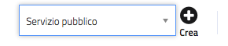

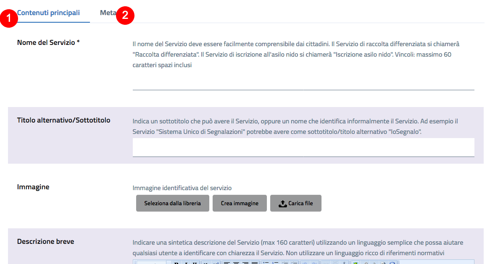

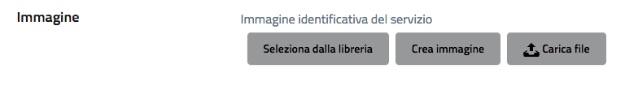

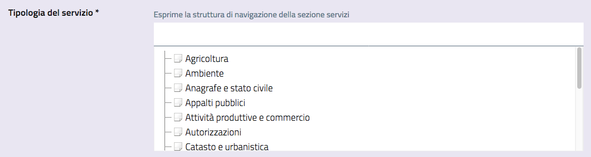

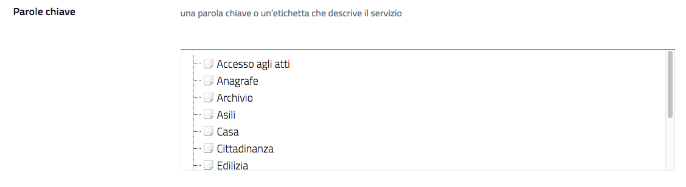

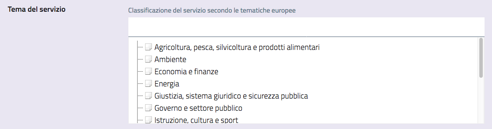

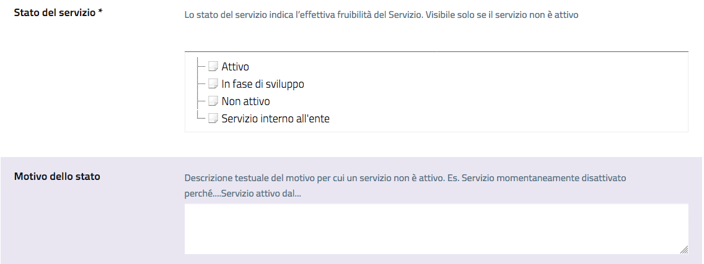

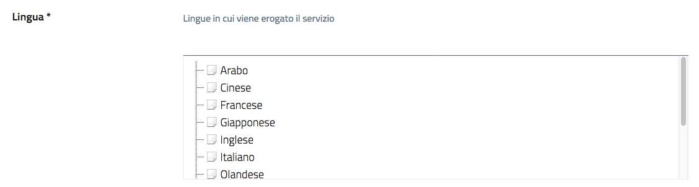

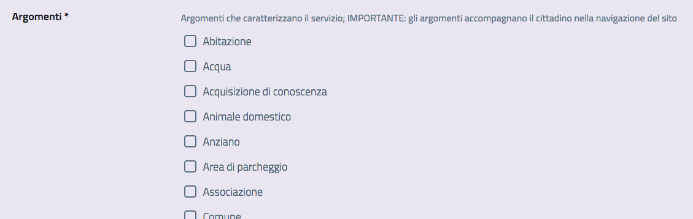

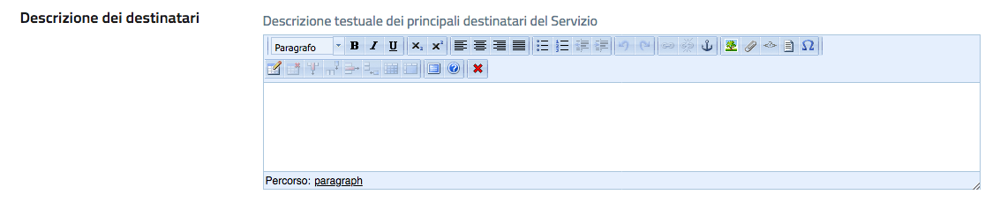

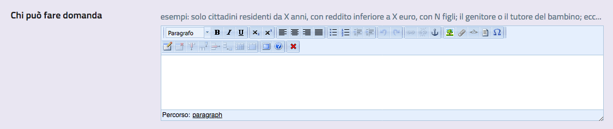

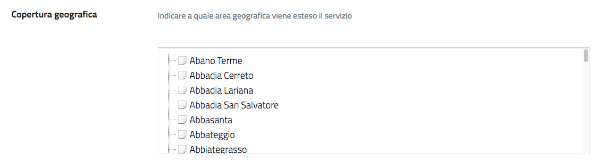

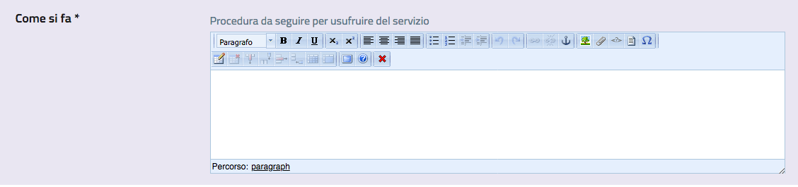

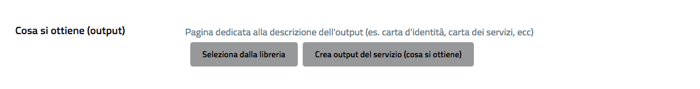

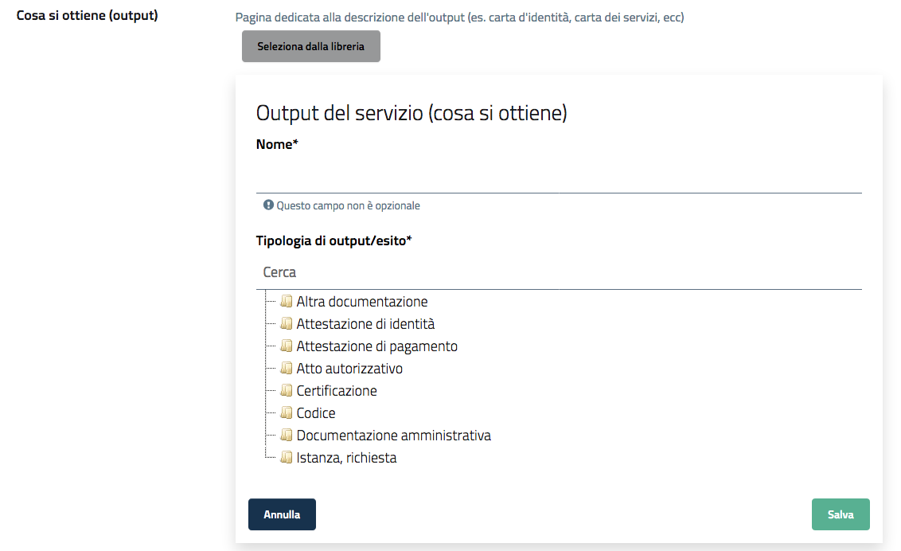

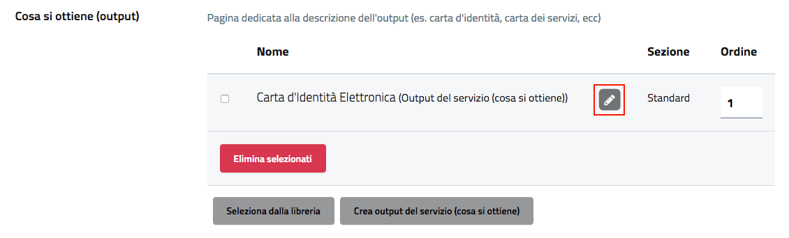

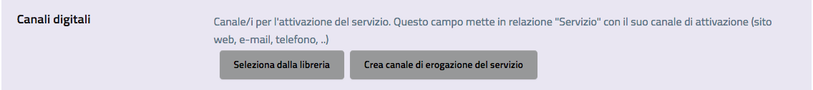

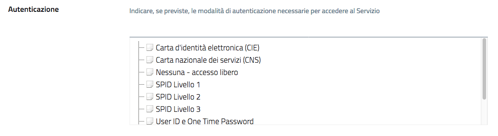

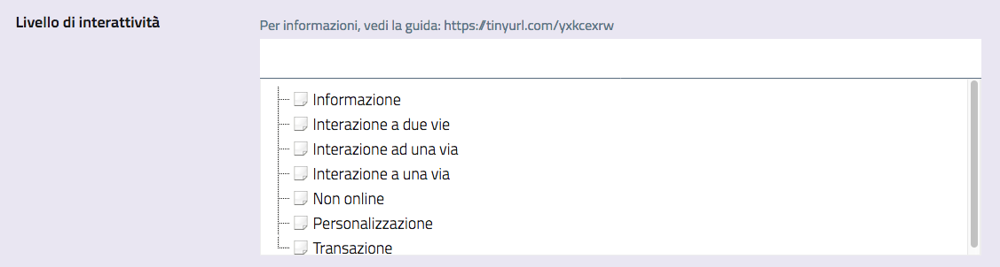

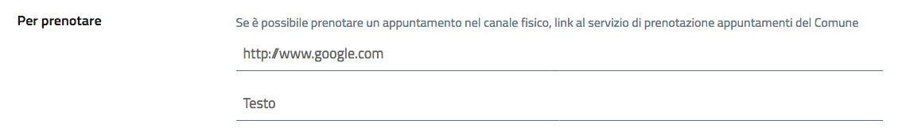

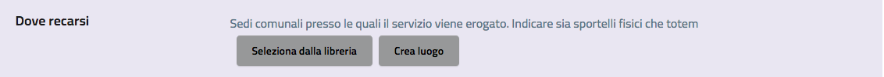

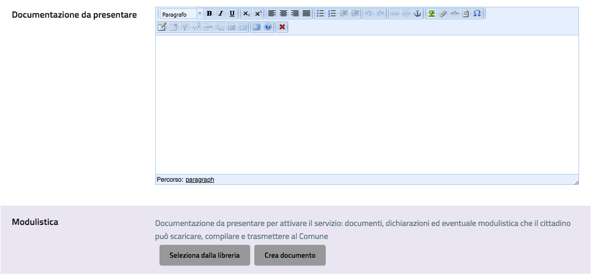

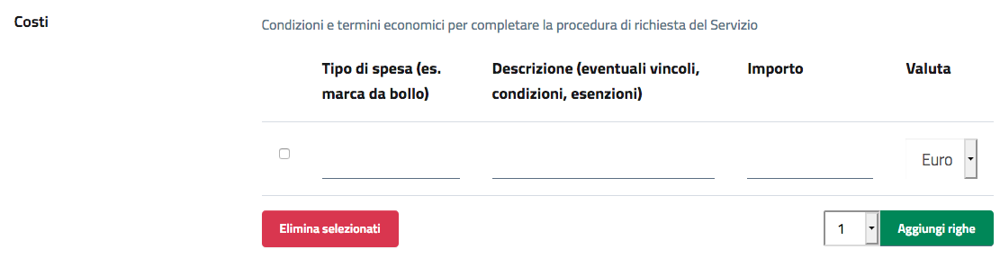

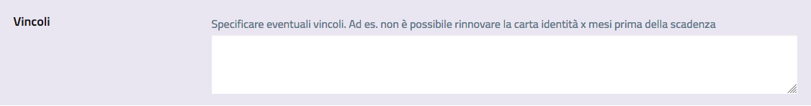

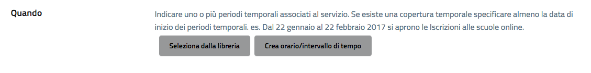

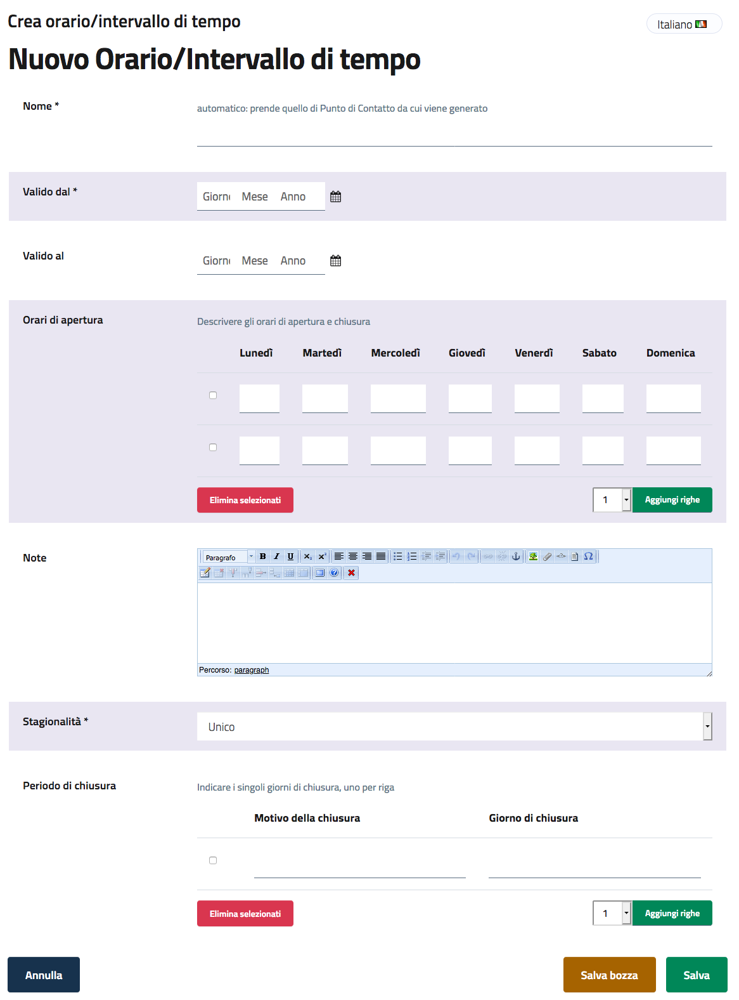

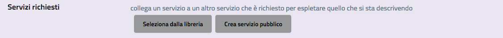

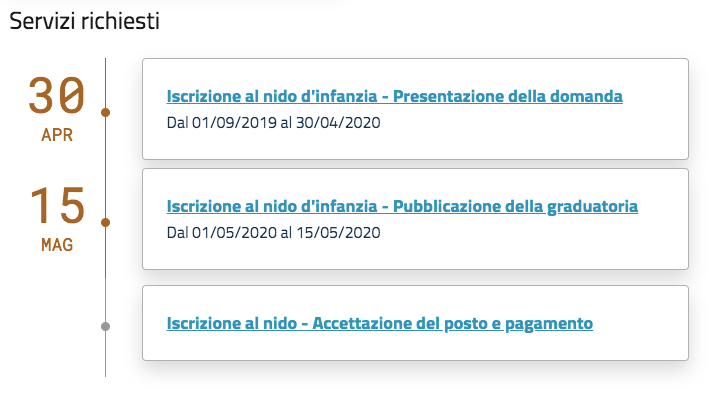

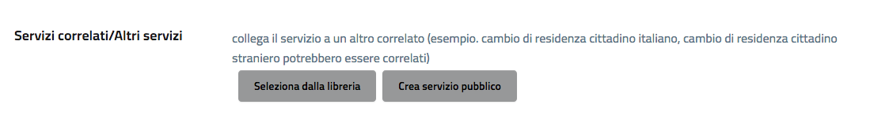

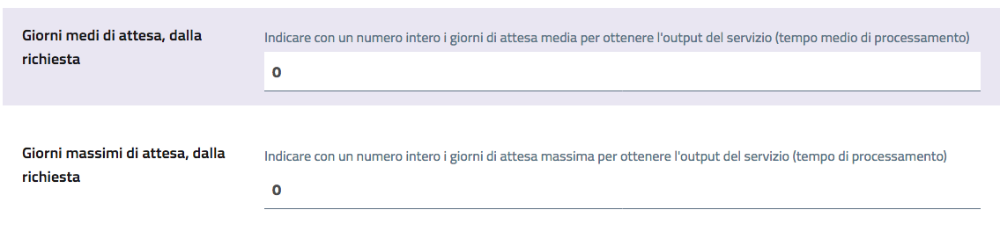

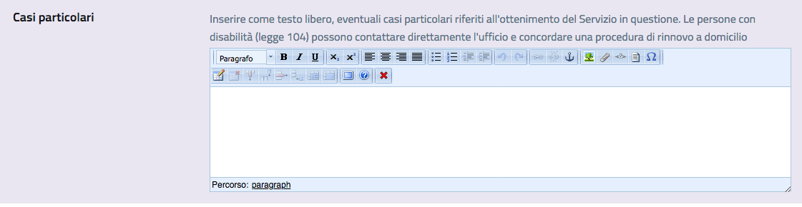
