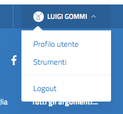
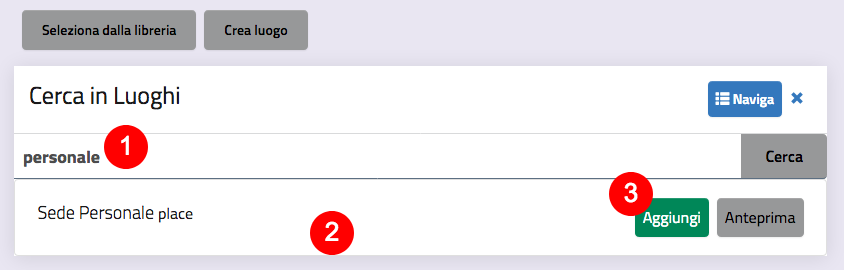
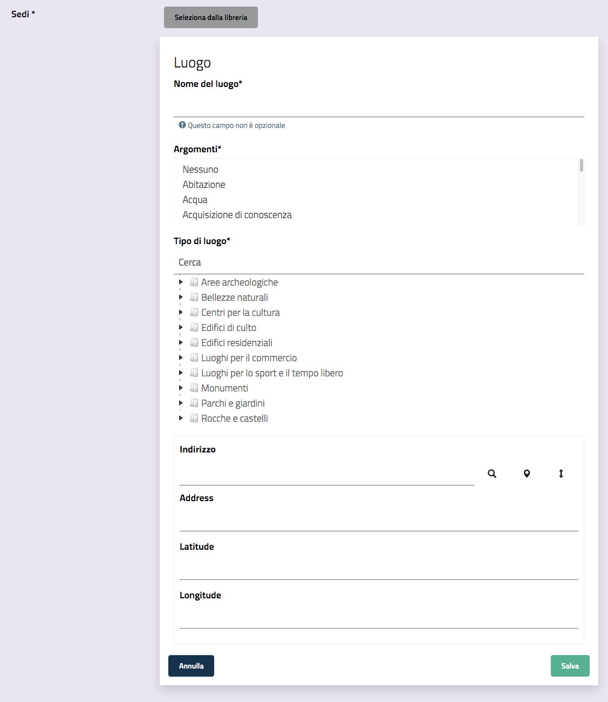
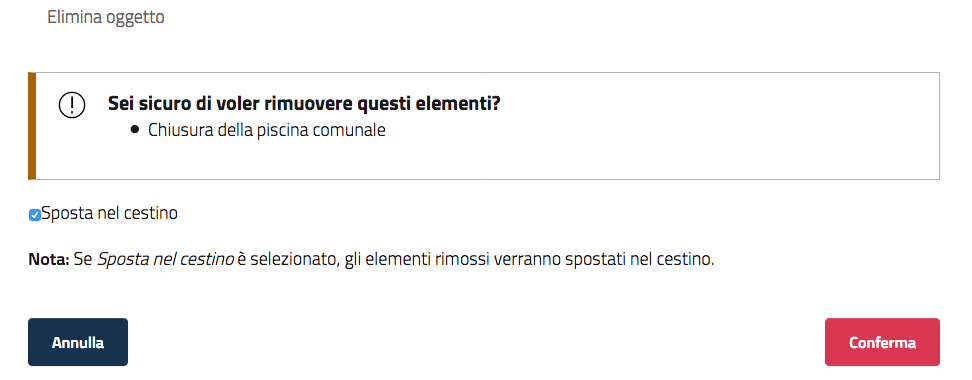
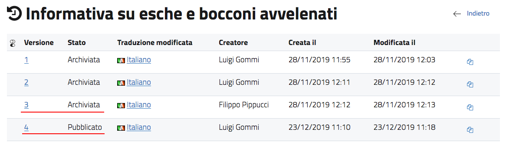
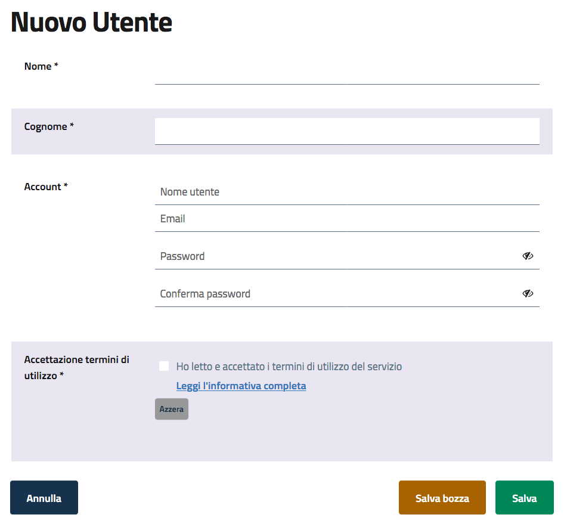

| `Accedere al sistema <#h335b7f3d697f654d534f30606a256b73>`_
| `Gestire il proprio profilo utente <#h7920172b3877f172e776d163b66136f>`_
|     `Modificare il proprio profilo <#h502d2f3d3a7e2a415f3d1418363e024>`_
|     `Modificare la propria password <#h78183160631a18412e6663409453854>`_
|     `Gestire le proprie bozze <#h5a37f227e8606261717952331d6859>`_
| `Gestire i contenuti <#h6b1b5153536a2c2324718636c626279>`_
|     `Il sistema di gestione dei contenuti: come funziona? <#h117f26752b3d1b796c432369501ce22>`_
|         `Le tipologie di contenuto <#h131a3e155422c61a341a277a394816>`_
|         `Struttura del sito <#h134c252677a7254751661226b3d38a>`_
|             `Le sezioni principali <#h465c4213f61341b393cd7116392473>`_
|             `Gli argomenti <#h3b3a103c276923422be6d444a155861>`_
|             `Le tassonomie <#h25697f4979b1063701456616563475>`_
|             `L’organizzazione dell’Ente: aree, uffici, dipendenti, sedi, orari, punti di contatto <#h4193a4315932f64293237a15a5c>`_
|     `L’interfaccia di inserimento e modifica dei contenuti <#h63724e1b3c307c32295b75b466b5b6a>`_
|         `Attributi geolocalizzazione <#h2138111d111f7f36145942796c576e34>`_
|         `Attributi Tag <#h185f172a1a6a5a4e2234693877122756>`_
|         `Attributi “Relazioni con altri oggetti” <#h6e77136753445b1e583825de206c11>`_
|             `Relazioni con Argomenti <#h30141b136d102e2c6d76711a59787c5>`_
|             `Relazioni generiche <#h1d34777621f466e1076432220123>`_
|             `Relazioni con immagini <#h40154724626e50301152f2e5215761>`_
|     `La barra degli strumenti <#h7c2b7466704f1f106c504a672c3d3750>`_
|     `Operazioni di base per la gestione dei contenuti <#h2d74135b66526b6c6c581f2e5312935>`_
|         `Creare un nuovo contenuto <#h446e1e74f406341a17187e2023342b>`_
|         `Modificare un contenuto esistente <#h623b12807a5967151285b15636b763e>`_
|         `Spostare un contenuto <#h6f797b5ae124496622133f2621740>`_
|         `Eliminare un contenuto <#h5e68755539e37045648426c163d17>`_
|         `Aggiungere una collocazione ad un contenuto <#h473670be537bd1f535923342b4e23>`_
|         `Ordinare un elenco di contenuti <#h186d3e232255c2d71724e1d376f4d6c>`_
|         `Visualizzare le informazioni sul contenuto <#h372466621173805f2b1c49ac2d54b>`_
|         `Gestire la pubblicazione di un contenuto <#h767585962235668053c5e40387877>`_
|             `Recuperare le proprie bozze <#h2f3f7022b1635513b1750385515162>`_
|             `Annullare una bozza <#hf307a4b362627629761f2e7d26b63>`_
|             `Gestire i conflitti di modifica <#h327b3c36507275f1c1c387c6f372ec>`_
|     `Operazioni avanzate per la gestione dei contenuti <#h25815704d1d2e42d3a6814682d5>`_
|         `Gestire le versioni di un contenuto <#h803704e74727f3f1969533867f4b16>`_
|             `Ripristinare la versione precedente di un oggetto <#h3262f5bf317e5654702b54655752d>`_
|         `Gestire i ruoli <#h687f5562516f10294e104d717a2c7f1f>`_
|             `Filtrare l’elenco dei ruoli visualizzati <#h5118a5b1a2430523745751c4a647e28>`_
|             `Modificare un ruolo <#h3e68781b152d6953384d792e76387d18>`_
|             `Cancellare un ruolo <#h713468422e664618514e4211d735932>`_
|             `Creare un nuovo ruolo <#h6f31a325f7540834554634102b227>`_
|         `Recuperare un contenuto dal cestino <#h232e647a3a7e55c77265a555d375d24>`_
|         `Creare la copia di un contenuto <#h1d3cd34b4e5629197d3b5d61546a46>`_
| `Funzioni di amministrazione <#h1f1bb1a237755101d748464d1f7b1c>`_
|     `Gestire gli utenti del sistema <#h1d1f141114611174b7928581a7c415>`_
|     `Gestire le info generali e l’aspetto estetico <#h7a36681e6036367d51384e5f6b6d52>`_
|         `Gestire le informazioni di Header e Footer <#h1b6b296d7e183c101d3641e1c1e4e>`_
|         `Modificare la home page: l’approccio a blocchi <#h422e7c50141a7b174f315b6b6031f32>`_
| `Esempio di inserimento contenuti, classe per classe <#h7f638084255365d7838781f4d19c78>`_

Il sistema è pensato per \ |STYLE0|\  da parte degli utenti redattori: la maggior parte delle attività di gestione del sito web può essere eseguita tramite una \ |STYLE1|\  integrata perfettamente nel front-end del sito web, il che rende possibile gestire i contenuti del sito mano a mano che lo si naviga, in un modo intuitivo e facile da imparare. La barra degli strumenti è visibile solamente da utenti registrati che hanno privilegi di modifica sul sito, ed è pertanto invisibile agli ospiti del sito. 

Anche le attività di amministrazione del sito possono essere portate a termine attraverso la barra degli strumenti. E’ tuttavia a disposizione una interfaccia di amministrazione (backend) che mette a disposizione tutte le funzionalità di gestione, oltre ad altre più avanzate.  Generalmente solo utenti avanzati (amministratori di siti), utilizzano l'interfaccia di amministrazione. 

.. _h335b7f3d697f654d534f30606a256b73:

Accedere al sistema
*******************

Per accedere al sistema è necessario cliccare sul link \ |STYLE2|\ .

\ |IMG1|\ 

Il sistema presenta il modulo di login. Per procedere è necessario inserire il proprio nome utente e la password e quindi fare clic sul pulsante \ |STYLE3|\ .

\ |IMG2|\ 

Nel caso in cui le credenziali inserite (Nome utente o Password) non siano valide (o non siano corrette), verrà mostrato il seguente messaggio:

\ |IMG3|\ 

\ |STYLE4|\ 

Se l’accesso va a buon fine, comparirà in alto la \ |STYLE5|\  del redattore. Inoltre, in alto a destra, al posto del link “Accedi all’area personale”, verranno visualizzati il nome e il cognome dell’utente che ha effettuato l’accesso.

\ |IMG4|\ 

.. _h7920172b3877f172e776d163b66136f:

Gestire il proprio profilo utente
*********************************

Una volta effettuato il login, cliccando sul nome utente in alto a destra, si accede ad un menù contestuale. 

\ |IMG5|\ 

Cliccando su Profilo utente si accede alla gestione del proprio profilo utente. Da questa interfaccia è possibile compiere alcune operazioni.

\ |IMG6|\ 

.. _h502d2f3d3a7e2a415f3d1418363e024:

Modificare il proprio profilo
=============================

Dopo aver acceduto al proprio Profilo utente, cliccando su Modifica profilo si arriva all’interfaccia che consente di modificare le proprie informazioni personali. 

..  Attention:: 

    Il nome utente non può essere modificato, poiché è l’elemento che identifica l’utente in maniera univoca all’interno del sistema.

.. _h78183160631a18412e6663409453854:

Modificare la propria password
==============================

Dopo aver acceduto al proprio Profilo utente, cliccando su \ |STYLE6|\  si arriva all’interfaccia che consente di modificare la propria password.

Il sistema chiede l’inserimento della password attuale (Vecchia password) e della nuova password. I vincoli sulla password vengono mostrati appena si entra nel campo “Nuova password”.

.. _h5a37f227e8606261717952331d6859:

Gestire le proprie bozze
========================

Una bozza è un contenuto che è stato inserito e salvato in eZ Publish, ma che non è ancora stato pubblicato. Le bozze possono essere nuovi contenuti o modifiche a contenuti esistenti. I visitatori del sito non possono vedere il contenuto delle bozze, ma l'utente che le ha create  può accedervi, modificarle ed eventualmente pubblicarle.

Per visualizzare tutte le proprie bozze è necessario accedere al proprio profilo utente e cliccare sul link Le mie bozze.

Per riprendere la modifica del contenuto, fare clic  sul nome di una bozza oppure sul pulsante \ |STYLE7|\  sul lato destro della bozza.\ |IMG7|\ 

Verrà visualizzata l'interfaccia di modifica standard. Dopo aver apportato le modifiche, è possibile pubblicare l'oggetto (1), salvarlo nuovamente come bozza (2), oppure annullare le modifiche (3).

\ |IMG8|\ 

È possibile eliminare tutte le bozze in una sola volta, cliccando il pulsante \ |STYLE8|\ , oppure selezionare le bozze da eliminare dal checkbox sulla sinistra, e poi cliccare il pulsante \ |STYLE9|\ .

\ |IMG9|\ 

.. _h6b1b5153536a2c2324718636c626279:

Gestire i contenuti
*******************

Per disporre delle funzionalità di gestione dei contenuti del sito web, è necessario aver effettuato l'accesso come utente con diritti di modifica (per impostazione predefinita, bisogna essere un membro dei gruppi Editor o Amministratori).

.. _h117f26752b3d1b796c432369501ce22:

Il sistema di gestione dei contenuti: come funziona?
====================================================

Il sistema Open City ha un forte orientamento alla strutturazione dei dati: i contenuti vengono creati scegliendo da diverse tipologie di contenuto predefinite, ognuna con caratteristiche differenti.

Le tipologie di contenuto disponibili in OpenCity sono quelle definite dal Team Digitale nel documento “\ |LINK1|\ ”. 

Ogni tipologia viene chiamata classe di contenuto, mentre uno specifico contenuto (creato a partire  da una classe) è chiamato oggetto.

.. _h131a3e155422c61a341a277a394816:

Le tipologie di contenuto
-------------------------

Le principali tipologie (classi) di contenuto disponibili In OpenCity sono le seguenti:

+------------------------------+---------------------------------------------------------------------------------------------------------------------------------------------------------------------------------------------------------------------------------------------------------------------------+
|Nome della classe             |Descrizione                                                                                                                                                                                                                                                                |
+==============================+===========================================================================================================================================================================================================================================================================+
|Area amministrativa           |Struttura organizzativa interna che accorpa più servizi                                                                                                                                                                                                                    |
+------------------------------+---------------------------------------------------------------------------------------------------------------------------------------------------------------------------------------------------------------------------------------------------------------------------+
|Argomento                     |Tematica trasversale a tutti i contenuti del sito                                                                                                                                                                                                                          |
+------------------------------+---------------------------------------------------------------------------------------------------------------------------------------------------------------------------------------------------------------------------------------------------------------------------+
|Avviso - Notizia - Comunicato |Format che consente di pubblicare una notizia, un comunicato stampa, un avviso                                                                                                                                                                                             |
+------------------------------+---------------------------------------------------------------------------------------------------------------------------------------------------------------------------------------------------------------------------------------------------------------------------+
|Dipendente                    |Persona che lavora per l'organizzazione pubblica, con contratto da dipendente                                                                                                                                                                                              |
+------------------------------+---------------------------------------------------------------------------------------------------------------------------------------------------------------------------------------------------------------------------------------------------------------------------+
|Documento                     |Qualsiasi tipo di documentazione prodotta dall'ente o da esso pubblicata all'interno dei propri canali digitali; ciascun file allegato deve essere accompagnato da opportuni metadati                                                                                      |
+------------------------------+---------------------------------------------------------------------------------------------------------------------------------------------------------------------------------------------------------------------------------------------------------------------------+
|Evento                        |Un evento di interesse pubblico                                                                                                                                                                                                                                            |
+------------------------------+---------------------------------------------------------------------------------------------------------------------------------------------------------------------------------------------------------------------------------------------------------------------------+
|Galleria fotografica          |Collezione di materiale fotografico                                                                                                                                                                                                                                        |
+------------------------------+---------------------------------------------------------------------------------------------------------------------------------------------------------------------------------------------------------------------------------------------------------------------------+
|Immagine                      |File immagine e relativi metadati                                                                                                                                                                                                                                          |
+------------------------------+---------------------------------------------------------------------------------------------------------------------------------------------------------------------------------------------------------------------------------------------------------------------------+
|Luogo                         |Punto di interesse per il cittadino o per il turista: ad esempio chiesa, percorso ciclabile, panorama, ...                                                                                                                                                                 |
+------------------------------+---------------------------------------------------------------------------------------------------------------------------------------------------------------------------------------------------------------------------------------------------------------------------+
|Orario/Intervallo di tempo    |Rappresenta un intervallo temporale, come gli orari di apertura di un ufficio                                                                                                                                                                                              |
+------------------------------+---------------------------------------------------------------------------------------------------------------------------------------------------------------------------------------------------------------------------------------------------------------------------+
|Organizzazione privata        |Un'organizzazione privata ufficialmente registrata presso un registro nazionale (registro imprese) o al registro delle associazioni                                                                                                                                        |
+------------------------------+---------------------------------------------------------------------------------------------------------------------------------------------------------------------------------------------------------------------------------------------------------------------------+
|Organizzazione pubblica       |Una pubblica amministrazione e qualsiasi altra organizzazione di natura pubblica, registrata presso l'Indice della PA (IPA)                                                                                                                                                |
+------------------------------+---------------------------------------------------------------------------------------------------------------------------------------------------------------------------------------------------------------------------------------------------------------------------+
|Pagina del sito               |Contenitore che consente di raggruppare una o più tipologie di contenuti                                                                                                                                                                                                   |
+------------------------------+---------------------------------------------------------------------------------------------------------------------------------------------------------------------------------------------------------------------------------------------------------------------------+
|Politico                      |Profilo pubblico di un amministratore locale                                                                                                                                                                                                                               |
+------------------------------+---------------------------------------------------------------------------------------------------------------------------------------------------------------------------------------------------------------------------------------------------------------------------+
|Punto di contatto on-line     |Raggruppa un insieme di tipi di canali di contatto, come email, social network, siti web, ma anche telefono e fax                                                                                                                                                          |
+------------------------------+---------------------------------------------------------------------------------------------------------------------------------------------------------------------------------------------------------------------------------------------------------------------------+
|Ruolo di una persona nel tempo|Rappresentazione di un ruolo di un dipendente o di un politico associato ad un intervallo temporale determinato                                                                                                                                                            |
+------------------------------+---------------------------------------------------------------------------------------------------------------------------------------------------------------------------------------------------------------------------------------------------------------------------+
|Servizio pubblico             |Scheda di presentazione del servizio ai cittadini. Per servizio pubblico si intende qualsiasi atto obbligatorio o discrezionale espletato da una pubblica amministrazione (o per conto di una pubblica amministrazione) nei confronti di cittadini, imprese/professionisti.|
+------------------------------+---------------------------------------------------------------------------------------------------------------------------------------------------------------------------------------------------------------------------------------------------------------------------+
|Soggetto / Organo politico    |Organo di indirizzo politico-amministrativo che definisce gli obiettivi e i programmi da attivare                                                                                                                                                                          |
+------------------------------+---------------------------------------------------------------------------------------------------------------------------------------------------------------------------------------------------------------------------------------------------------------------------+
|Ufficio                       |Un ufficio dell'organizzazione; nell'ambito delle organizzazioni pubbliche è anche detto unità organizzativa o struttura                                                                                                                                                   |
+------------------------------+---------------------------------------------------------------------------------------------------------------------------------------------------------------------------------------------------------------------------------------------------------------------------+

Ogni classe di contenuto è composta da una serie di campi (detti \ |STYLE10|\ ) che rappresenta le singole caratteristiche di quella tipologia di contenuto.  Gli attributi vanno compilati in fase di creazione e/o modifica dei contenuti: \ |STYLE11|\ .

Ad esempio, la classe di contenuto \ |STYLE12|\  contiene attributi come:

* Titolo 

* Breve descrizione

* Immagini

* Data di pubblicazione

* Corpo della news

* ...

Gli attributi possono essere di tipo diverso. I più semplici sono \ |STYLE13|\ , \ |STYLE14|\ , ma ci sono tipi più complessi, come ad esempio \ |STYLE15|\ , oppure attributi di tipo \ |STYLE16|\ : questo tipo di attributo consente di mettere in relazione tra di loro degli oggetti: nel caso della classe di contenuto \ |STYLE17|\ , ad esempio, uno degli attributi si chiama \ |STYLE18|\ : serve per indicare l’ufficio responsabile del contenuto. In fase di compilazione in quel campo non si scriverà il nome dell’ufficio, ma si cercherà tra gli oggetti di classe “Ufficio” già censiti all’interno del sistema, per selezionare quello che rappresenta l’ufficio responsabile del contenuto di quella notizia.

Una menzione particolare va fatta per la classe \ |STYLE19|\  (ruolo di una persona nel tempo). Questa classe rappresenta la relazione tra una persona e una struttura. In particolare, serve per:

#. specificare il ruolo di un Politico nei confronti di un Organo Politico. Ad esempio 

+----------------+--------------+------------------+
|Politico        |Nome del ruolo|Organo Politico   |
+================+==============+==================+
|Roberto Bianchi |Presidente    |Consiglio Comunale|
+----------------+--------------+------------------+

#. Specificare il ruolo di un dipendente nei confronti di un Ufficio (o area amministrativa)

+-----------------+--------------+-----------------+
|Dipendente       |Nome del ruolo|Ufficio          |
+=================+==============+=================+
|Milena Tiribocchi|Responsabile  |Ufficio personale|
+-----------------+--------------+-----------------+

.. admonition:: Un sistema per la mappatura della realtà

    Le classi di contenuto servono per avere una mappatura quasi uno a uno tra contenuti del sistema web e la realtà. Questo presenta numerosi vantaggi, come ad esempio la facilità di organizzare ricerche mirate (solo su determinate tipologie di contenuto) o l’esportazione dei contenuti in formato Open Data. 

Uno dei vantaggi di questo approccio alla gestione dei contenuti è che le informazioni vengono salvate e mantenute in un unico punto. Si pensi ad esempio ad un numero di telefono: esso è salvato in un oggetto di tipo \ |STYLE20|\ . Quando viene pubblicato un contenuto e si vuole indicare una modalità per richiedere maggiori informazioni, anziché scrivere un numero di telefono direttamente nel testo, viene inserito un link verso il punto di contatto che detiene l’informazione. Se il numero di telefono cambia, non è necessario eseguire un tedioso “trova e sostituisci” all’interno dei contenuti del sito, ma basta aggiornare i contenuti del punto di contatto.

Solo alcune tipologie di oggetti sono configurate per poter essere “contenitori” di altri oggetti. Ad esempio, è possibile creare oggetti di tipo Immagine sotto un oggetto di tipo Galleria immagini, ma non è possibile farlo sotto un oggetto “Dipendente”, o “Ufficio”.

.. _h134c252677a7254751661226b3d38a:

Struttura del sito
------------------

La struttura di un sistema basato su OpenCity è predefinita, e segue il \ |STYLE21|\  definito dal Team Digitale. OpenCity prevede:

* quattro \ |STYLE22|\  dove inserire i contenuti, 

* degli aggregatori di contenuto basati si cosiddetti \ |STYLE23|\ ,

* delle \ |STYLE24|\  utilizzate per etichettare i contenuti,

* Una modalità per descrivere l’\ |STYLE25|\  (intesa come articolazione di aree e uffici)

.. _h465c4213f61341b393cd7116392473:

Le sezioni principali
~~~~~~~~~~~~~~~~~~~~~

Sono previste le seguenti sezioni principali:

* \ |STYLE26|\ 

* \ |STYLE27|\ 

* \ |STYLE28|\ 

* \ |STYLE29|\ 

Esse  sono quelle visibili e raggiungibili direttamente dal menu principale del sito.

\ |IMG10|\ 

\ |STYLE30|\ 

In ognuna di queste sezioni vanno create specifiche tipologie di contenuto. 

\ |STYLE31|\ 

Lo scopo di questa sezione è di descrivere l’ente e il suo funzionamento sia dal punto di vista amministrativo che politico. Contiene le informazioni sulle aree e sugli uffici, compresi recapiti, numeri di telefono e personale, ma anche sugli organi politici e sui politici che ne fanno parte.

+------------------------+------------------------------------------------------------------------------------------------------------------------------+-----------------------------+
|nodo                    |descrizione                                                                                                                   |Tipo di contenuto da inserire|
+========================+==============================================================================================================================+=============================+
|Organi politici         |contiene gli organi politici del comune: Consiglio comunale, Giunta, eventuali commissioni, i gruppi consiliari.              |Organo politico              |
|                        |                                                                                                                              |                             |
+------------------------+------------------------------------------------------------------------------------------------------------------------------+-----------------------------+
|Aree amministrative     |contiene le aree amministrative secondo le quali è strutturato il comune.                                                     |Area amministrativa          |
+------------------------+------------------------------------------------------------------------------------------------------------------------------+-----------------------------+
|Strutture               |contiene gli uffici comunali. Ogni ufficio ha una relazione con l’area amministrativa di riferimento.                         |Ufficio                      |
+------------------------+------------------------------------------------------------------------------------------------------------------------------+-----------------------------+
|Politici                |contiene l’elenco dei politici del comune                                                                                     |Politico                     |
+------------------------+------------------------------------------------------------------------------------------------------------------------------+-----------------------------+
|Personale amministrativo|contiene l’elenco dei dipendenti del Comune                                                                                   |Dipendente                   |
+------------------------+------------------------------------------------------------------------------------------------------------------------------+-----------------------------+
|Enti e fondazioni       |contiene la lista di enti e fondazioni che, a qualche titolo, sono collegate al comune (ad esempio società controllate        |Organizzazione pubblica      |
|                        |                                                                                                                              |                             |
|                        |                                                                                                                              |Organizzazione privata       |
+------------------------+------------------------------------------------------------------------------------------------------------------------------+-----------------------------+
|Luoghi                  |contiene  i luoghi del Comune. Sia quei luoghi che hanno una rilevanza storico/turistica, ma anche le sedi dei singoli uffici.|Luogo                        |
|                        |                                                                                                                              |                             |
+------------------------+------------------------------------------------------------------------------------------------------------------------------+-----------------------------+

\ |STYLE32|\ 

Qui vengono esposti i servizi che un ente eroga nei confronti dei propri cittadini. La descrizione dei servizi segue lo standard europeo CPSV, con lo scopo di fornire ai visitatori del sito delle informazioni chiare rispetto al servizio stesso.

+----+---------------------------------------------------------+-----------------------------+
|nodo|descrizione                                              |Tipo di contenuto da inserire|
+====+=========================================================+=============================+
|-   |contiene i servizi offerti dall’ente ai propri cittadini.|Servizio pubblico            |
|    |                                                         |                             |
+----+---------------------------------------------------------+-----------------------------+

\ |STYLE33|\ 

Attraverso i contenuti di questa sezione, l’ente gestisce la propria comunicazione.

+-----------------+---------------------------------------------------+-----------------------------+
|nodo             |descrizione                                        |Tipo di contenuto da inserire|
+=================+===================================================+=============================+
|Avvisi           |contiene gli \ |STYLE34|\  istituzionali del Comune|avviso - notizia - comunicato|
|                 |                                                   |                             |
+-----------------+---------------------------------------------------+-----------------------------+
|Notizie          |contiene le \ |STYLE35|\  del Comune               |avviso - notizia - comunicato|
+-----------------+---------------------------------------------------+-----------------------------+
|Comunicati stampa|contiene i  \ |STYLE36|\  del Comune               |avviso - notizia - comunicato|
+-----------------+---------------------------------------------------+-----------------------------+
|Eventi           |contiene gli eventi del Comune                     |Evento                       |
+-----------------+---------------------------------------------------+-----------------------------+

\ |STYLE37|\ 

Questa sezione raccoglie tutti i documenti prodotti dall’ente, classificati per tipologia. Ogni documento dovrebbe finire qui dentro, e può essere eventualmente collegato a contenuti  che stanno nelle altre sezioni. Si pensi ad esempio alla descrizione di un servizio: se per usufruirne è necessario compilare e presentare dei documenti, essi saranno inseriti nel nodo “Modulistica” e richiamati dalla scheda del servizio.

+-------------------------------+-------------------------------------------------------------+-----------------------------+
|nodo                           |descrizione                                                  |Tipo di contenuto da inserire|
+===============================+=============================================================+=============================+
|Documenti albo pretorio        |contiene quei documenti che vanno pubblicati in albo pretorio|Documento                    |
+-------------------------------+-------------------------------------------------------------+-----------------------------+
|Modulistica                    |contiene tutti i moduli del Comune                           |Documento                    |
+-------------------------------+-------------------------------------------------------------+-----------------------------+
|Documenti funzionamento interno|contiene documenti di bilancio, lo statuto, regolamenti      |Documento                    |
+-------------------------------+-------------------------------------------------------------+-----------------------------+
|Normative                      |contiene eventuali normative in vigore                       |Documento                    |
+-------------------------------+-------------------------------------------------------------+-----------------------------+
|Accordi tra enti               |accordi, convenzioni, documenti di partnership               |Documento                    |
+-------------------------------+-------------------------------------------------------------+-----------------------------+
|Documenti attività politica    |documenti relativi alle sedute, interrogazioni, ...          |Documento                    |
+-------------------------------+-------------------------------------------------------------+-----------------------------+
|Documenti (tecnici) di supporto|manuali, e documenti di supporto ad altri contenuti          |Documento                    |
+-------------------------------+-------------------------------------------------------------+-----------------------------+
|Dataset                        |contiene i dataset con gli opendata esposti dal Comune       |Dataset                      |
+-------------------------------+-------------------------------------------------------------+-----------------------------+

.. _h2c1d74277104e41780968148427e:

.. _h3b3a103c276923422be6d444a155861:

Gli argomenti
~~~~~~~~~~~~~

Ognuna delle tipologie di contenuto ha un attributo che consente di specificare l’argomento a cui quel contenuto si riferisce. Tutti i contenuti marcati con un certo argomento, vengono visualizzati aggregati nei contenitori “Argomenti”. La lista degli argomenti è definita dal Team Digitale nel documento “\ |LINK2|\ ”. Ognuno degli argomenti fa riferimento ad Eurovocs, una collezione vocabolari controllati definiti a livello europeo. Ad esempio di veda la definizione dell’argomento \ |LINK3|\ .

Questo approccio basato sugli standard fa in modo che i concetti primitivi che sottostanno la struttura delle informazioni contenute nel sito possa essere compresi anche in altre lingue, rendendo i contenuti di un sito ricercabili anche in altre lingue.

.. _h25697f4979b1063701456616563475:

Le tassonomie
~~~~~~~~~~~~~

Seguendo le indicazioni del Team Digitale, il sistema OpenCity mette a disposizione delle tassonomie che consentono di etichettare i contenuti. Le tassonomie disponibili fanno riferimento al \ |LINK4|\  sviluppati nell'ambito delle azioni previste dal piano triennale per l'informatica della Pubblica Amministrazione.

Fanno parte di queste tassonomie:

* Documenti

    * \ |LINK5|\ 

* \ |LINK6|\ 

* \ |LINK7|\ 

* Servizi pubblici

    * \ |LINK8|\ 

    * \ |LINK9|\ 

    * \ |LINK10|\ 

    * \ |LINK11|\ 

    * \ |LINK12|\ 

    * \ |LINK13|\ 

    * \ |LINK14|\ 

    * \ |LINK15|\ 

* \ |LINK16|\ 

.. _h4193a4315932f64293237a15a5c:

L’organizzazione dell’Ente: aree, uffici, dipendenti, sedi, orari, punti di contatto
~~~~~~~~~~~~~~~~~~~~~~~~~~~~~~~~~~~~~~~~~~~~~~~~~~~~~~~~~~~~~~~~~~~~~~~~~~~~~~~~~~~~

L’articolazione delle aree e degli uffici dell’Ente viene rappresentata in OpenCity secondo il modello definito da Team Digitale e dalle ontologie esistenti a livello europeo.

Le tipologie di oggetto che entrano in gioco sono:

* Area Amministrativa

* Ufficio

* Luogo

* Punto di Contatto

* Orario

* Dipendente

* Ruolo

I collegamenti tra le varie entità sono qui descritti. 

* Un \ |STYLE38|\  è collegato all’\ |STYLE39|\  di riferimento

* Una struttura \ |STYLE40|\  può essere collegata a una o più sedi \ |STYLE41|\ 

* Una struttura \ |STYLE42|\  può essere collegata a uno o più \ |STYLE43|\  (che contengono email e numeri di telefono)

* Una sede \ |STYLE44|\  sia collegata a uno o più \ |STYLE45|\ 

* Un \ |STYLE46|\  mette in relazione un \ |STYLE47|\  con una struttura (\ |STYLE48|\ )

È importante avere chiaro questo schema per capire come organizzare le informazioni che riguardano l’articolazione degli uffici di un Ente. Queste informazioni, che risultano visibili nella sezione “Amministrazione”, costituiscono la base per il resto dei contenuti: quando si inserisce un \ |STYLE49|\ , esso può essere relazionato all’\ |STYLE50|\  che si occupa dell’erogazione di quel servizio, evitando la duplicazione delle informazioni.

.. _h63724e1b3c307c32295b75b466b5b6a:

L’interfaccia di inserimento e modifica dei contenuti
=====================================================

L’interfaccia di inserimento e modifica dei contenuti è strettamente legata alla tipologia del contenuto (classe) che si sta creando o modificando. La lista dei campi che un redattore è chiamato a compilare è espressione dell’insieme degli attributi che compongono la classe.

A tipologie di attributi differenti corrispondono differenti modalità di inserimento dati. Ad esempio un attributo di tipo \ |STYLE51|\  consente l’inserimento di testo semplice, uno di tipo \ |STYLE52|\  permette di inserire titoli, grassetti, elenchi puntati e numerati

\ |IMG11|\ 

\ |STYLE53|\ 

\ |STYLE54|\ 

\ |STYLE55|\ , che serve di aiuto al redattore in fase di  compilazione.

Gli attributi la cui compilazione è \ |STYLE56|\  per il salvataggio del contenuto sono contrassegnati con un \ |STYLE57|\ .

Vi sono poi alcune tipologie di attributi che vale la pena descrivere in profondità: comprenderne complessità e potenzialità è utile per una soddisfacente gestione dei contenuti.

.. _h2138111d111f7f36145942796c576e34:

Attributi geolocalizzazione
---------------------------

Questo tipo di attributo consente di specificare una posizione geografica, identificata da una coppia di valori per latitudine e longitudine. La ricerca di posizione è basata sul progetto open source OpenStreetMap.

\ |IMG12|\ 

\ |STYLE58|\ 

Per compilarlo, è possibile inserire un indirizzo nel campo di ricerca (1) e premere il tasto invio della tastiera, oppure premere il pulsante “Rileva posizione” (2): in questo secondo caso, il sistema proverà a rilevare la posizione corrente - è possibile che il browser chieda l’autorizzazione a condividere i dati sulla posizione con il sistema.

In ogni momento è possibile operare uno zoom con i pulsanti “+/-” (3).

Quando si inserisce un indirizzo e si preme invio (4), il sistema cerca quell’indirizzo nel database di OpenStreetMap, e mostra i risultati in una lista (5).

\ |IMG13|\ 

Facendo click sull’elemento della lista corrispondente all’indirizzo che si è cercato, il sistema centra la mappa in quel punto, e mostra un marker. Inoltre, i campi indirizzo, latidudine e longitudine vengono compilati con i dati relativi al punto, estratti dal database di OpenStreetMap.

\ |IMG14|\ 

Il marker può essere spostato trascinandolo con il mouse sul punto preciso della mappa. Operando in questo modo, si vedranno i valori dei tre campi (indirizzo, latidudine e longitudine) cambiare

Una volta soddisfatti della posizione del marker, è consigliabile modificare il campo “Indirizzo”, (spesso le informazioni che arrivano da OpenStreetMap sono piuttosto prolisse), poiché il valore di quel campo viene esposto ai visitatori.

.. _h185f172a1a6a5a4e2234693877122756:

Attributi Tag
-------------

Gli attributi di tipo tag consentono di impostare uno o più valori. L’interfaccia si presenta con un campo di ricerca (1) ed una lista (2), che può svilupparsi su più livelli.

\ |IMG15|\ 

\ |STYLE59|\ 

Per aggiungere un tag è sufficiente espandere eventuali sottolivelli e fare click sul tag desiderato, oppure iniziare a scrivere il nome del tag che si cerca nel campo di ricerca: il sistema filtrerà i tag, mostrando una lista di quelli che soddisfano i criteri di ricerca. Cliccando sull’elemento desiderato nella lista dei risultati, il tag verrà selezionato.

\ |IMG16|\ 

\ |IMG17|\ 

\ |STYLE60|\ 

.. _h6e77136753445b1e583825de206c11:

Attributi “Relazioni con altri oggetti”
---------------------------------------

Come visto in precedenza, ci sono attributi il cui scopo è definire una relazione tra oggetti di tipo diverso.  Questi attributi sono di tipo “relazioni tra oggetti”.  

.. _h30141b136d102e2c6d76711a59787c5:

Relazioni con Argomenti
~~~~~~~~~~~~~~~~~~~~~~~

Il funzionamento degli argomenti è molto simile a quello dei tag. Anche l’interfaccia per la selezione degli argomenti è simile a quella per la selezione dei tag, con un campo di ricerca (1) e la lista degli argomenti (2):

\ |IMG18|\ 

Il click su una delle voci la mette in evidenza: questo significa che l’Argomento è stato selezionato. E’ possibile selezionare più di un argomento cliccando mentre è premuto il tasto ctrl (Windows) o cmd (Mac).

\ |IMG19|\ 

\ |STYLE61|\ 

Per quanto riguarda gli argomenti (così come per i tag), l’interfaccia è di sola selezione, e non consente di aggiungere argomenti (in quanto provengono da una lista predefinita)

.. _h1d34777621f466e1076432220123:

Relazioni generiche
~~~~~~~~~~~~~~~~~~~

Rientrano sotto questa categoria la maggior parte di attributi che definiscono relazioni tra oggetti. Ad esempio la relazione tra un Avviso e l’ufficio competente, tra un luogo e il suo orario, oppure tra un ufficio e le sue sedi. Prendiamo ad esempio quest’ultimo caso. Si sta creando un nuovo Ufficio, e ci si trova in procinto di popolare l’attributo “Sedi”.

\ |STYLE62|\  \ |STYLE63|\  \ |STYLE64|\  \ |STYLE65|\ 

L’interfaccia consente sia di selezionare un luogo dalla libreria oppure di crearne uno nuovo. Il contenitore di riferimento per i luoghi all’interno del sito è “Amministrazione/Luoghi”.

Scegliendo \ |STYLE66|\  si apre l’interfaccia che consente di sfogliare la libreria o, se si conosce il nome del luogo da aggiungere, cercare al suo interno.

In modalità \ |STYLE67|\  è possibile aggiungere uno dei luoghi visualizzati (1), oppure procedere con l’esplorazione della libreria (2). 

\ |IMG20|\ 

La modalità \ |STYLE68|\  viene attivata con un click sull’apposito pulsante:

\ |IMG21|\  

Inserendo un termine nel box di ricerca (1) è possibile filtrare la lista di luoghi (2) ed aggiungerne uno alla relazione con un click sul pulsante “aggiungi” (3):

\ |IMG22|\ 

Indipendentemente dalla modalità scelta (naviga o cerca),  luoghi aggiunti vengono inseriti nell’attributo “Sedi”:

\ |IMG23|\ 

A questo punto è possibile modificare uno dei luoghi (1), modificare l’ordine con cui i luoghi selezionati appaiono (se sono più d’uno) (2), oppure eliminare uno dei luoghi dall’attributo “Sedi”, selezionando il checkbox relativo (3) e premendo il pulsante “Elimina selezionati” (4).

Scegliendo \ |STYLE69|\ , il sistema consente la creazione di un oggetto luogo contestuale alla creazione dell’oggetto Ufficio sul quale si sta lavorando.

\ |IMG24|\ 

Il modulo contestuale presenta solo gli attributi obbligatori da compilare per consentire il salvataggio dell’oggetto correlato. Eventuali altri dati possono essere aggiunti successivamente.

\ |IMG25|\ 

\ |STYLE70|\ 

Una volta compilati i vari attributi, cliccando il tasto salva si otterrà che:

* Il nuovo oggetto “luogo” verrà salvato nella libreria dei luoghi (Amministrazione/Luoghi)

* Il nuovo oggetto creato sarà aggiunto all’attributo “Sedi” dell’oggetto Ufficio sul quale si sta lavorando.

L’esempio fatto per la relazione tra un ufficio e un luogo vale per tutti i casi in cui ci sia un attributo che rappresenta una relazione con altri oggetti. L’unica eccezione la fanno gli oggetti di tipo “Immagine”, a cui è dedicato una spiegazione ad hoc.

.. _h40154724626e50301152f2e5215761:

Relazioni con immagini
~~~~~~~~~~~~~~~~~~~~~~

Se un attributo definisce una relazione con oggetti \ |STYLE71|\ , la sua gestione è leggermente diversa. Consente di selezionare un’immagine dalla libreria (1), creare un nuovo oggetto \ |STYLE72|\  (2), oppure caricare un file (jpg, png, gif, ...) (3).  

\ |IMG26|\ 

\ |STYLE73|\  \ |STYLE74|\ 

Le funzioni \ |STYLE75|\  e \ |STYLE76|\  sono  identiche a quelle descritte precedentemente (Attributi “Relazioni con altri oggetti” - Relazioni generiche).

In più questo tipo di attributo consente di caricare uno o più file (di tipo immagine, ovvero con estensione jpg, png, gif, …). Facendo un click sul pulsante “Carica file”, si apre la finestra di sistema per selezionare i file dal proprio computer. Dopo aver selezionato i file, essi verranno caricati sul sistema all’interno di oggetti di tipo Immagine. 

\ |STYLE77|\ , nemmeno quelli obbligatori. Essi potranno essere compilati editando i singoli oggetti dopo che sono stati creati, facendo click sul pulsante “modifica” (con l’icona della matita) dalla lista delle immagine collegate all’attributo:

\ |IMG27|\ 

.. _h7c2b7466704f1f106c504a672c3d3750:

La barra degli strumenti
========================

Dopo aver acceduto al sistema, se il proprio profilo utente appartiene al gruppo Editor o Amministratori, viene mostrata, su ogni pagina del sito, la barra degli strumenti per la gestione dei contenuti.

\ |IMG28|\ 

\ |STYLE78|\ 

La barra degli strumenti consente di disporre delle funzionalità di \ |STYLE79|\  direttamente sulle pagine del sito (senza bisogno di accedere all’interfaccia di amministrazione, dedicata a utenti avanzati). In questo modo è possibile navigare il sito come un normale visitatore, operare modifiche a contenuti esistenti, spostare contenuti, dargli un ordine oppure creare nuovi contenuti.

.. admonition:: Importante

    Le operazioni che è possibile svolgere attraverso l’uso della barra degli strumenti \ |STYLE80|\  in quel momento: ad esempio se si sta visualizzando un contenuto di tipo “Dipendente” e si clicca sull’icona con la matita (modifica), verrà modificato esattamente quel contenuto. La stessa cosa vale per la creazione di nuovi contenuti, la cancellazione, e così via.

Le funzionalità disponibili sulla barra degli strumenti variano a seconda del profilo dell’utente che ha effettuato il login. I redattori (gruppo di utenti Editor) hanno funzionalità semplificate, mentre gli amministratori hanno accesso completo a tutte le funzionalità. 

\ |IMG29|\ 

\ |STYLE81|\ 

Ad esempio, se un redattore si trova nel nodo \ |STYLE82|\ , nella lista delle tipologie di oggetti che è possibile creare sarà presente l’unica tipologia “Luogo”. Questa limitazione non è presente per gli utenti amministratori.

.. _h2d74135b66526b6c6c581f2e5312935:

Operazioni di base per la gestione dei contenuti
================================================

Per la gestione ordinaria dei contenuti, tutte le operazioni necessarie sono attivabili dalla  barra degli strumenti, che permette agli utenti redattori di:

* \ |STYLE83|\ ;

* \ |STYLE84|\ 

* \ |STYLE85|\ 

* \ |STYLE86|\ 

* \ |STYLE87|\ 

* \ |STYLE88|\  (ovvero fare in modo che uno stesso contenuto sia raggiungibile in diverse sezioni del sito);

* \ |STYLE89|\ 

.. _h446e1e74f406341a17187e2023342b:

Creare un nuovo contenuto
-------------------------

\ |IMG30|\ 

La creazione di un contenuto avviene nel seguente modo: si naviga il sito fino a raggiungere il contenitore all’interno del quale si vuole creare il contenuto, ad esempio “Amministrazione/Luoghi”:

\ |IMG31|\ 

Dalla tendina nella barra degli strumenti (1), è possibile filtrare le tipologie di contenuto (2) e  selezionare il tipo di contenuto da creare (3). Infine si preme sul pulsante Crea qui (4):

\ |IMG32|\ 

\ |STYLE90|\  \ |STYLE91|\ \ |STYLE92|\ 

.. admonition:: Attenzione!

    Poichè le azioni svolte attraverso la barra degli strumenti \ |STYLE93|\  in quel momento, è molto importante fare attenzione al contenitore in cui ci si trova nel momento in cui si clicca il pulsante \ |STYLE94|\ : il contenuto verrà creato esattamente lì.

Una volta effettuate queste operazioni, il sistema presenta l’interfaccia di inserimenti di un nuovo contenuto, con la lista degli attributi da compilare.

\ |IMG33|\ 

\ |STYLE95|\ 

.. admonition:: Attributi obbligatori

    Nelle interfacce di creazione e modifica dei contenuti, alcuni degli attributi sono marcati con un asterisco. Questo significa che è obbligatorio compilare quegli attributi.

Una volta compilati i campi, è possibile pubblicare il contenuto oppure salvarlo come bozza.

.. _h623b12807a5967151285b15636b763e:

Modificare un contenuto esistente
---------------------------------

\ |IMG34|\ 

Per modificare un contenuto esistente, è sufficiente \ |STYLE96|\  che si desidera modificare attraverso i menu e i link del sito, esattamente come farebbe un visitatore. Una volta raggiunto il contenuto da modificare, \ |STYLE97|\  per accedere all’\ |STYLE98|\  che è identica a quella di modifica di un contenuto, con la differenza che i campi (attributi) non saranno vuoti.

.. _h6f797b5ae124496622133f2621740:

Spostare un contenuto
---------------------

\ |IMG35|\ 

Per spostare il contenuto da una posizione a un'altra sul sito, utilizzare il pulsante \ |STYLE99|\  nella barra degli strumenti del sito web: il sistema consente di navigare il sito web e scegliere la nuova posizione per il contenuto:

\ |IMG36|\ 

Per navigare, è possibile cliccare sul nome di un nodo (1) per visualizzare il contenuto al suo interno, oppure cliccare sulla freccia (2) per spostarsi verso l’alto nell’albero dei contenuti.

È possibile scegliere il nuovo contenitore aggiungendo la spunta accanto al suo nome (3) e cliccare poi il pulsante “Seleziona” (4). 

..  Attention:: 

    * Spostando un contenitore, il sistema sposta anche i contenuto sotto quell'oggetto. Ad esempio, se sposti una cartella contenente articoli da una posizione a un'altra, tutti gli articoli verranno spostati.
    
    * Lo spostamento del contenuto dipende dai permessi dell’utente.

.. _h5e68755539e37045648426c163d17:

Eliminare un contenuto
----------------------

\ |IMG37|\ 

Per rimuovere il contenuto, navigare verso l'oggetto desiderato e fare clic sul pulsante \ |STYLE100|\  sulla barra degli strumenti. 

Il sistema chiede se il contenuto deve essere spostato nel cestino (predefinito) o se esso debba essere eliminato in modo definitivo:

\ |IMG38|\ 

* Per \ |STYLE101|\  (predefinito), è sufficiente cliccare il pulsante “Conferma”.

* \ |STYLE102|\  è necessario de-selezionare la spunta “Sposta nel cestino” prima di cliccare sul pulsante “Conferma”.

..  Attention:: 

    Prestare molta attenzione durante la cancellazione dei contenuti, poiché queste azioni influiscono anche su altri contenuti del sito:
    
    * Se viene rimosso un contenitore, verranno rimossi anche gli elementi contenuti al suo interno. Ad esempio, rimuovendo una pagina contenente documenti, anche essi verranno rimossi.
    
    * Se ci sono collegamenti ad un contenuto che viene rimosso, i collegamenti vengono interrotti.

Tutti i contenuti spostati nel cestino in fase di cancellazione sono recuperabili. Tuttavia si tratta di una operazione che è possibile effettuare solo accedendo all’interfaccia di amministrazione (backend), e quindi dedicata agli amministratori.

.. _h473670be537bd1f535923342b4e23:

Aggiungere una collocazione ad un contenuto
-------------------------------------------

\ |IMG39|\ 

Come descritto in precedenza, ogni contenuto del sito ha una collocazione in una struttura ad albero. La funzionalità \ |STYLE103|\  consente di rendere uno stesso contenuto visibile in più sezioni del sito. Lo stesso oggetto può infatti avere più collocazioni all'interno dell'albero dei contenuti. 

Per pubblicare un contenuto in una posizione aggiuntiva, accedere alla pagina desiderata, quindi fare clic sul pulsante \ |STYLE104|\ : il sistema consente di navigare il sito web e scegliere le collocazioni aggiuntive per il contenuto:

\ |IMG40|\ 

Per navigare, è possibile cliccare sul nome di un nodo (1) per visualizzare il contenuto al suo interno, oppure cliccare sulla freccia (2) per spostarsi verso l’alto nell’albero dei contenuti.

È possibile scegliere la nuova collocazione aggiungendo la spunta accanto al suo nome (3) e cliccare poi il pulsante “Seleziona” (4).

..  Attention:: 

    Il fatto che un contenuto possa o meno essere collocato in una certa posizione dell’albero dei contenuti dipende dalle configurazioni del sistema: ad esempio, il nodo “Luoghi” è configurato per contenere solo oggetti di tipo Luogo, e quindi il sistema non consentirà di aggiungere una collocazione di un oggetto di tipo Evento nel contenitore dei luoghi.

.. _h186d3e232255c2d71724e1d376f4d6c:

Ordinare un elenco di contenuti
-------------------------------

\ |IMG41|\ 

Quando si sta visualizzando un contenitore che contiene diversi contenuti (detti anche “figli”), è possibile controllare l’ordine con il quale vengono visualizzati, cliccando sul pulsante “Ordina”: si apre l’interfaccia che consente di impostare l’ordinamento dei figli di un nodo.

\ |IMG42|\ 

\ |STYLE105|\ 

L’ordinamento degli oggetti dentro un nodo viene definito  scegliendo il criterio (1) e il verso dell’ordinamento (2) - che può essere ascendente o discendente - per poi impostare la modalità di ordinamento per il nodo (3), e aggiornare la priorità per il contenitore (4). Da quel momento, gli oggetti figli del contenitore saranno ordinati secondo il criterio e il verso scelto.

Esistono molti modi diversi per ordinare un elenco di contenuti. I \ |STYLE106|\  più comuni sono: 

* \ |STYLE107|\ : ordine alfabetico ascendente (dalla A alla Z) oppure discendente (dalla Z alla A)

* \ |STYLE108|\ : ordine cronologico in base alla data di pubblicazione ascendente (dal primo pubblicato all’ultimo) oppure discendente (dall’ultimo pubblicato al primo)

* \ |STYLE109|\ : in questa modalità è possibile ordinare i contenuti manualmente assegnando una priorità ad ognuno di essi. La priorità può essere impostata come ascendente (dal numero più basso al più alto) oppure discendente (dal numero più alto al più basso). 

\ |STYLE110|\ 

L’ordinamento per priorità prevede l’impostazione del criterio (priorità) e del verso (ascendente/discendente) - come illustrato precedentemente. Una volta che la modalità di ordinamento è stata impostata a “priorità”, è necessario definire le priorità dei singoli figli. Questa operazione può essere portata a termine attraverso l’inserimento di numeri interi nella sezione a destra “Priorità” (1) oppure attraverso il trascinamento manuale (2).

\ |IMG43|\ 

\ |STYLE111|\ 

.. _h372466621173805f2b1c49ac2d54b:

Visualizzare le informazioni sul contenuto
------------------------------------------

Mentre si sta visualizzando un qualsiasi contenuto, è possibile vedere alcune informazioni importanti su di esso. Per accedere a queste informazioni, è necessario fare click sul pulsante “info” sulla barra degli strumenti:

\ |IMG44|\ 

Si aprirà una finestra con le informazioni sull’oggetto visualizzato:

\ |IMG45|\ 

Alcune delle informazioni sono utili per l’attività redazionale, altre sono invece di natura tecnica e hanno a che fare con il funzionamento del sistema. 

* \ |STYLE112|\  indica chi è l’utente che ha apportato l’ultima modifica all’oggetto, e la data di modifica;

* \ |STYLE113|\  indica chi è l’utente che ha creato il contenuto, e la data di creazione;

* \ |STYLE114|\  l’identificatore del nodo che contiene l’oggetto all’interno dell’albero dei contenuti

* \ |STYLE115|\  l’identificatore dell’oggetto che rappresenta il contenuto

* \ |STYLE116|\  indica quali sono le collocazioni dell’oggetto all’interno dell’albero dei contenuti (potrebbero essere più d’una)

* \ |STYLE117|\  la sezione alla quale appartiene il nodo. 

* \ |STYLE118|\  la tipologia del contenuto che si sta visualizzando.

* \ |STYLE119|\  un oggetto può avere diversi stati. Questa funzionalità è utile nel caso di integrazione con sistemi esterni per la gestione dell’albo telematico.

.. _h767585962235668053c5e40387877:

Gestire la pubblicazione di un contenuto
----------------------------------------

Quando si crea o si modifica un contenuto, sulla barra degli strumenti vengono mostrati quattro pulsanti che servono per gestire la pubblicazione del contenuto.

\ |IMG46|\ 

Le operazioni corrispondenti ai pulsanti sono descritte di seguito:

* \ |STYLE120|\ : serve per pubblicare il contenuto, che viene salvato ed è immediatamente disponibili sul sito web.

* \ |STYLE121|\ : dopo aver lavorato su un contenuto, è possibile salvare il tuo lavoro senza renderlo visibile subito sul sito web. Quando si crea una \ |STYLE122|\ , la versione “bozza” dell'oggetto viene salvata senza essere pubblicata. Per salvare una bozza, cliccare il pulsante \ |STYLE123|\  nella pagina di modifica: questo consente di salvare il proprio lavoro e di continuare a lavorare sulla bozza. Se invece si vuole salvare una bozza ma continuare a lavorarci in un secondo momento, cliccare su \ |STYLE124|\ .

* \ |STYLE125|\  la modifica in corso viene annullata e l’interfaccia di inserimento/modifica viene chiusa. 

Le stesse operazioni sono disponibili anche in fondo all’interfaccia di inserimento/modifica, a meno del pulsante “Salva bozza ed esci”:

\ |IMG47|\ 

.. _h2f3f7022b1635513b1750385515162:

Recuperare le proprie bozze
~~~~~~~~~~~~~~~~~~~~~~~~~~~

Esistono due metodi per recuperare le bozze: 

#. Accedere alla pagina \ |STYLE126|\  dal proprio profilo utente: lì vengono visualizzate tutte le proprie bozze.

#. Modificare una pagina precedentemente pubblicata, per la quale è stata creata un bozza. Dopo aver cliccato il pulsante “Modifica”, verrà indicato che è presente una bozza per quel contenuto. Sarà possibile modificare la bozza precedentemente creata (1), oppure modificare la versione correntemente pubblicata, creando quindi una nuova bozza (2).

\ |IMG48|\ 

.. _hf307a4b362627629761f2e7d26b63:

Annullare una bozza
~~~~~~~~~~~~~~~~~~~

\ |IMG49|\ 

Durante la creazione un nuovo contenuto o la modifica di un contenuto già esistente, è possibile decidere di annullare il lavoro apportato, eliminando la bozza creata. Questo non influirà in alcun modo sul contenuto eventualmente già pubblicato, ma eliminerà semplicemente la bozza contenente eventuali modifiche apportate. Per farlo, basta cliccare il pulsante \ |STYLE127|\ .

Un altro modo per eliminare le bozze, è quello di accedere al proprio Profilo utente, cliccare su “Le mie bozze” e successivamente sul pulsante “Svuota bozze”, oppure selezionare le bozze da eliminare dal checkbox sulla sinistra, e poi cliccare il pulsante \ |STYLE128|\ .

\ |IMG50|\ 

.. _h327b3c36507275f1c1c387c6f372ec:

Gestire i conflitti di modifica
~~~~~~~~~~~~~~~~~~~~~~~~~~~~~~~

Durante l’attività di gestione dei contenuti, soprattutto nei casi in cui più persone lavorano su uno stesso contenuto, può capitare che ci si imbatta in un messaggio che segnala un \ |STYLE129|\  del contenuto. 

Questo di solito accade quando due persone stanno cercando di modificare lo stesso oggetto, oppure quando qualcuno ha lasciato una bozza aperta. Il messaggio di possibile conflitto di modifica del contenuto è il seguente:

\ |IMG51|\ 

I paragrafi seguenti spiegano quali possono essere le diverse cause del conflitto di modifica e propongono alcune relative soluzioni.

\ |STYLE130|\ 

A volte, quando si modifica un contenuto, può capitare di chiudere accidentalmente il browser, di uscire dall’interfaccia di modifica utilizzando il tasto “Indietro” del proprio browser oppure semplicemente di fare clic sul pulsante "Salva bozza e esci". 

Quello che succede, in questi casi, è che il sistema salva una bozza (n. 55) di quell’oggetto che si stava modificando. Ogni volta che proverai a modificare di nuovo l'oggetto, il sistema ti avviserà di questo. 

L'immagine seguente mostra come appare questo avvertimento.

\ |IMG52|\ 

\ |STYLE131|\ 

Il sistema sta semplicemente cercando di avvisare l’utente che egli ha già iniziato a modificare questo oggetto ma non ne ha ancora pubblicato il contenuto. Potrebbero esserci anche più bozze aperte. In tal caso, la finestra sotto l'avviso mostrerà tutte le bozze non pubblicate relative a questo oggetto.

\ |STYLE132|\ 

* È possibile selezionare una delle bozze (es.: n. 6) e modificarla utilizzando il pulsante \ |STYLE133|\ . Questo è l'approccio più comunemente usato poiché di solito c'è solo una bozza non pubblicata. Se ci sono diverse bozze non pubblicate, sarebbe utile rimuoverle per evitare ulteriori conflitti. Inoltre, si dovrebbe eventualmente  selezionare la bozza più recente da modificare, in modo da continuare a lavorare sulla versione più aggiornata.

* Si può creare una nuova bozza facendo clic sul pulsante \ |STYLE134|\  e modificarla (in questo caso verrà creata una nuova bozza, n. 7). Tuttavia, la nuova bozza sarà una copia della versione pubblicata. La bozza che causa il conflitto (n. 6) potrebbe contenere informazioni aggiornate/nuove. Se viene creata una nuova bozza, bisognerebbe quindi assicurarsi di rimuovere quella che causa il conflitto.

\ |STYLE135|\ 

A volte, può capitare che qualcun altro stia modificando lo stesso oggetto che si sta provando a modificare. Potrebbe essere che l'altra persona lo stia modificando proprio in quel momento, oppure che l'altra persona abbia lasciato una bozza aperta (5). In tutti questi casi, quando si proverà a modificare lo stesso oggetto, il sistema mostrerà un avviso che indica che esiste un conflitto di modifica.

\ |IMG53|\ 

Il sistema avvisa di prestare attenzione,  perché qualcun altro sta lavorando sullo stesso oggetto. Si noti che potrebbero esserci diverse bozze nell'elenco. Tuttavia, il caso più comune è che ce ne sia una sola. A differenza dello scenario precedente, non è possibile modificare la bozza (che causa il conflitto) perché \ |STYLE136|\ .

\ |STYLE137|\ 

* Puoi creare una nuova bozza facendo clic sul pulsante \ |STYLE138|\  e modificarla. Tuttavia, tieni presente che la nuova bozza sarà una copia della versione pubblicata (n. 5). La bozza che causa il conflitto (n. 6) potrebbe contenere informazioni aggiornate/nuove. Il consiglio in questo caso è di \ |STYLE139|\ . Se invece si decide di procedere nella creazione di una nuova bozza (n. 7), è da tener presente che le modifiche che si intendono apportare potrebbe essere sovrascritte nel momento in cui la persona che sta modificando la bozza n. 6 decide di pubblicarla.

\ |STYLE140|\ 

A volte, può capitare che qualcun altro stia modificando lo stesso oggetto che si desidera modificare. Inoltre, potrebbero esserci ulteriori bozze che sono state lasciate aperte dall’utente corrente. In questo caso, l'interfaccia di amministrazione mostrerà un avviso simile a quelli mostrati nei casi precedenti.

\ |IMG54|\ 

In questo caso, il consiglio è di \ |STYLE141|\  e/o di sbarazzarsi delle proprie bozze aperte, se necessario.

.. _h25815704d1d2e42d3a6814682d5:

Operazioni avanzate per la gestione dei contenuti
=================================================

* \ |STYLE142|\ 

* \ |STYLE143|\  collegati agli oggetti di tipo \ |STYLE144|\  e \ |STYLE145|\ 

* \ |STYLE146|\ 

* \ |STYLE147|\ 

.. _h803704e74727f3f1969533867f4b16:

Gestire le versioni di un contenuto
-----------------------------------

Nel sistema Open City, ogni contenuto creato viene memorizzato come "\ |STYLE148|\ ". Ad esempio, un avviso è un oggetto, un luogo è un oggetto, un account utente è un oggetto, e così via.

Quando si crea un nuovo oggetto, viene assegnato un \ |STYLE149|\  (es.: 1). Quando si modifica l'oggetto, viene assegnato un nuovo numero di versione (es.: 2, 3 e così via). Sia l'originale che le nuove versioni dell'oggetto vengono memorizzate nel database.

Grazie a questo sistema di controllo delle versioni, è possibile \ |STYLE150|\ . Ad esempio, se una nuova versione di un oggetto contiene un errore, è possibile ripristinare l'oggetto alla versione precedente.

Solo un numero limitato di versioni di ciascun oggetto viene memorizzato nel database (per evitare che il database cresca in maniera incontrollabile). Il sistema memorizza, oltre alla versione pubblicata, un massimo di 10 versioni precedenti.

.. _h3262f5bf317e5654702b54655752d:

Ripristinare la versione precedente di un oggetto
~~~~~~~~~~~~~~~~~~~~~~~~~~~~~~~~~~~~~~~~~~~~~~~~~

La funzionalità è disponibile solo per gli utenti membri dei gruppi Editor e Administrator.

Per ripristinare una versione precedente di un oggetto è necessario:

* accedere al sistema, 

* Navigare verso il contenuto che si desidera ripristinare. 

* Dal menù “Altro” selezionare “Amministra versioni”

\ |IMG55|\ 

Il sistema mostrerà tutte le versioni disponibili per quell’oggetto, indicando anche il loro stato.

\ |IMG56|\ 

Lo scopo è ripristinare l’ultima versione prima di quella pubblicata. Per farlo, è necessario individuare la versione da ripristinare (nell’esempio, la numero 2) e cliccare sul corrispondente pulsante “Copia” sulla destra.

Il sistema aprirà la finestra di modifica del contenuto, creando la versione 4 dell’oggetto. Terminate le modifiche al contenuto, se si clicca sul pulsante “Pubblica”, la versione 4 verrà pubblicata, mentre la versione 3 verrà archiviata.

\ |IMG57|\ 

.. _h687f5562516f10294e104d717a2c7f1f:

Gestire i ruoli
---------------

Come descritto in precedenza, i ruoli servono per collegare una persona a una struttura, ad esempio un dipendente a un ufficio, o un politico ad un organo politico. Una volta che il ruolo è stato creato, esso viene mostrato sia sulla scheda della persona, che su quella della struttura.

\ |IMG58|\ 

\ |STYLE151|\ 

\ |IMG59|\ 

\ |STYLE152|\ 

Per \ |STYLE153|\  dalla barra degli strumenti fare click su “Amministra” e poi, dal menù a tendina, scegliere “Gestione ruoli”.

\ |IMG60|\ 

Si aprirà l’interfaccia per la gestione dei ruoli, dove vengono mostrati tutti i ruoli presenti.

\ |IMG61|\ 

\ |STYLE154|\ 

Questa interfaccia consente di effettuare le seguenti operazioni:

.. _h5118a5b1a2430523745751c4a647e28:

Filtrare l’elenco dei ruoli visualizzati
~~~~~~~~~~~~~~~~~~~~~~~~~~~~~~~~~~~~~~~~

Il sistema consente di \ |STYLE155|\  attraverso l’utilizzo del motore di ricerca: È sufficiente scrivere un termine nel campo di ricerca (1) e fare click sul pulsante “cerca” (2): la lista verrà filtrata in base al termine inserito (ad esempio un nome, oppure “Responsabile”, “Presidente”, e così via…).

.. _h3e68781b152d6953384d792e76387d18:

Modificare un ruolo
~~~~~~~~~~~~~~~~~~~

Nella lista dei ruoli, facendo click sul pulsante a destra con l’icona della matita (3) è possibile accedere all’interfaccia di modifica di un ruolo.

.. _h713468422e664618514e4211d735932:

Cancellare un ruolo
~~~~~~~~~~~~~~~~~~~

Nella lista dei ruoli, facendo click sul pulsante a destra con l’icona del cestino (4) è possibile cancellare quel ruolo. Prima di procedere alla cancellazione, il sistema chiederà conferma della volontà di eliminare quel ruolo.

.. _h6f31a325f7540834554634102b227:

Creare un nuovo ruolo
~~~~~~~~~~~~~~~~~~~~~

Per \ |STYLE156|\  è necessario fare click sul pulsante “Crea nuovo” (5):  si accede in questo modo all’interfaccia di creazione di un nuovo ruolo.

\ |IMG62|\ 

\ |STYLE157|\  

Sono presenti tre liste da cui scegliere:

* \ |STYLE158|\  nella lista vengono mostrati tutti gli oggetti di tipo Dipendente e di tipo Politico censite nel sistema,

* \ |STYLE159|\  nella lista vengono mostrati tutti gli oggetti di tipo Ufficio, Area amministrativa, Organizzazione pubblica, Organizzazione privata,

* \ |STYLE160|\  la lista mostra i valori possibili per la descrizione del ruolo.

È possibile specificare altre informazioni per un ruolo, come le date di inizio e fine incarico, eventuali deleghe collegate, o se si tratta di un incarico  “dirigenziale” o di tipo “posizione organizzativa”. 

Dopo aver compilato i campi, fare click sul pulsante “Salva” per salvare il ruolo..

.. _h232e647a3a7e55c77265a555d375d24:

Recuperare un contenuto dal cestino
-----------------------------------

Il recupero di un contenuto rimosso e inserito nel cestino avviene attraverso l’interfaccia di amministrazione.  

Per accedere all'interfaccia di amministrazione, è necessario fare click sul pulsante “Amministra” della barra degli strumenti. Dal menù a tendina scegliere la voce “Backend”

\ |IMG63|\ 

Una volta effettuato l’accesso all’interfaccia di amministrazione, fare click su “Struttura contenuti” (1) e poi, dal menù sula sinistra, su “Cestino” (2).

\ |IMG64|\ 

Il contenitore del cestino ha una struttura "piatta", il che significa che tutti gli oggetti sono elencati allo stesso livello indipendentemente dalla posizione che avevano originariamente nella struttura dei contenuti.

Per ripristinare un oggetto contenuto dal cestino, cliccare sull'icona a forma di matita nella colonna a destra. Verrà richiesto se si desidera ripristinare l'oggetto nella posizione originale o in una nuova posizione. Dopo aver specificato il percorso, fare clic su OK.

Se si tenta di recuperare un contenuto il cui contenitore originale è stato rimosso, si è obbligati a scegliere una nuova posizione per esso.

.. _h1d3cd34b4e5629197d3b5d61546a46:

Creare la copia di un contenuto
-------------------------------

Il sistema permette di creare una copia di un contenuto esistente sul sito. Questa funzionalità è utile in quei casi in cui di deve creare un nuovo oggetto che è uguale a un esistente tranne che per pochi valori.

Una volta visualizzato l’oggetto del quale si vuole creare la copia, accedere alla funziona dalla barra degli strumento, facendo click su “Altro” e poi su “Crea una copia dell’oggetto”

\ |IMG65|\ 

Il sistema effettua una copia del contenuto e la apre direttamente nell’interfaccia di modifica. A questo punto è sufficiente apportare le modifiche desiderate e fare click sul pulsante “Salva”.

.. _h1f1bb1a237755101d748464d1f7b1c:

Funzioni di amministrazione
***************************

.. _h1d1f141114611174b7928581a7c415:

Gestire gli utenti del sistema
==============================

Un amministratore ha la facoltà di aggiungere utenti al sistema. In particolare può creare dei nuovi utenti “Redattori”.

Per accedere a questa funzionalità, è necessario, dalla barra degli strumenti, fare click su “Amministra”, e poi, nel menù a tendina che si apre, su “Account utenti”:

\ |IMG66|\ 

Il sistema mostra l’elenco dei gruppi utente. Fare click su “Redattori”: viene mostrata la lista degli utenti appartenenti al gruppo dei redattori. Per aggiungere un utente, dal selettore delle classi sulla  barra degli strumenti scegliere “Utente” (1) e poi fare click sul pulsante “Crea” (2):

\ |IMG67|\ 

In seguito a questa azione, viene visualizzata l’interfaccia per l’inserimento di un nuovo utente.

\ |IMG68|\ 

\ |STYLE161|\ 

 

Come si vede in figura, tutti i campi sono obbligatori. Da notare che il nome utente è quello che identifica in maniera univoca un utente all’interno del sistema, e non è pertanto modificabile una volta impostato. La password che si va ad impostare è temporanea: al primo accesso, il sistema chiederà all’utente di modificarla.

Facendo click sul pulsante “Salva”, l’utente verrà salvato nel gruppo dei Redattori. L’operatività dell’account utente è immediata: appena accederà al sistema, disporrà delle funzionalità previste per il gruppo dei Redattori.

.. _h7a36681e6036367d51384e5f6b6d52:

Gestire le info generali e l’aspetto estetico
=============================================

Un sito web basato su Open City presenta diverse informazioni generali nell’intestazione del sito (header) e nel piè di pagina (footer). Tutte queste informazioni possono essere gestite da un utente amministratore. È inoltre possibile variare l’aspetto della Home page, per decidere cosa mettere in risalto.

In particolare, l’\ |STYLE162|\  di un sito web basato sul sistema Open City si presenta è conforme alle indicazioni del Team Digitale (https://designers.italia.it/progetti/siti-web-comuni/), e si presenta come in figura:

\ |IMG69|\ 

\ |STYLE163|\ 

Ognuno degli elementi (numerati in figura) viene descritto di seguito:

#. Il menù principale. È fisso e definito dalle Linee Guida del Team Digitale;

#. Il logo del Comune, che deve essere un’immagine in formato png trasparente (per integrarsi con il colore di sfondo) e necessariamente quadrato;

#. L’ente di livello superiore di riferimento (regione o provincia autonoma);

#. Eventuali canali social del Comune;

#. Gli argomenti in evidenza, scelti tra la lista completa degli argomenti;

#. Link rilevanti che l’ente potrebbe voler di inserire.

Il \ |STYLE164|\  presenta delle informazioni di servizio, che riguardano principalmente i contatti dell’ente.

\ |IMG70|\ 

\ |STYLE165|\ 

#. Informazioni generiche sull’ente, con la possibilità di inserire anche dei link;

#. Contatti (email, telefono, …), partita iva e codice fiscale;

#. Informazione sui canali social (replicati rispetto all’header);

#. Link di servizio (privacy, note legali, …).

.. _h1b6b296d7e183c101d3641e1c1e4e:

Gestire le informazioni di Header e Footer
------------------------------------------

Per modificare le informazioni presentate in header e footer è necessario navigare sulla home page del sito, per poi fare click sul pulsante “Modifica” dalla barra degli strumenti.

\ |IMG71|\ 

Scorrendo la pagina verso il basso, si trovano gli attributi relativi alle varie informazioni che è possibile modificare:

* \ |STYLE166|\  per modificare l’immagine utilizzata nel logo

* \ |STYLE167|\  il link mostrato nell’header (header - 6)

* \ |STYLE168|\  i link mostrati nel footer (footer - 4)

* \ |STYLE169|\  il testo che compare sotto il titolo “Informazioni” nel footer (footer - 1)

* \ |STYLE170|\  i contatti, mostrati nel footer (footer - 2), e i canali social, mostrati in header (header - 4, footer - 3)

* \ |STYLE171|\  dalla lista degli argomenti, è possibile selezionare i tre da mostrare nell’header del sito web (header - 5)

.. _h2c1d74277104e41780968148427e:

.. _h422e7c50141a7b174f315b6b6031f32:

Modificare la home page: l’approccio a blocchi
----------------------------------------------

La home page di un sito web è la vetrina sulla quale mostrare i contenuti più rilevanti. Il sistema OpenCity consente di modificare l’aspetto estetico della home page, organizzata a fasce orizzontali che mostrano il contenuto in con determinate modalità. 

Seguendo questo approccio, la home page può essere confezionata a seconda delle esigenze dell’ente, mettendo in evidenza un contenuto piuttosto che un altro. 

\ |IMG72|\ 

\ |STYLE172|\ 

Nell’esempio in figura vi sono quattro blocchi:

#. Blocco \ |STYLE173|\  contenente un \ |STYLE174|\ 

#. Blocco \ |STYLE175|\  contenente due \ |STYLE176|\  e un \ |STYLE177|\ 

#. Blocco \ |STYLE178|\  contenente un \ |STYLE179|\ 

#. Blocco \ |STYLE180|\  contente tre \ |STYLE181|\ 

Se si va in modifica della Home page (click sul pulsante “Modifica” nella barra degli strumenti), si trova l’attributo “Layout”, che si presenta come in figura:

\ |IMG73|\ 

\ |STYLE182|\ 

All’interno del layout sono posizionati i blocchi, ognuno dei quali corrisponde a una delle fasce visibili sulla home page.  I blocchi visibili in questa lista sono rappresentati dal nome del tipo di blocco (es. “Oggetto singolo”) e dall’eventuale titolo (es. “Argomenti (tipo) - Argomenti in evidenza (titolo)”)

L’interfaccia consente di:

#. Espandere un blocco per vederne e modificarne la configurazione;

#. Spostare un blocco verso l’alto o verso il basso. Questo avrà l’effetto di spostare verso l’alto o verso il basso la corrispondente fascia;

#. Cancellare un blocco;

#. Espandere tutti i blocchi;

#. Comprimere tutti i blocchi;

#. Inserire un nuovo blocco, scegliendo il tipo dalla tendina e facendo click su “Aggiungi blocco”

Espandendo uno dei blocchi, è possibile accedere alla configurazione del blocco stesso:

\ |IMG74|\ 

\ |STYLE183|\ 

Un blocco “Lista manuale” consente di mostrare una lista di contenuti che vanno scelti manualmente. 

L’interfaccia di configurazione mostra i contenuti inseriti (1), permette inoltre di:

* aggiungere nuovi contenuti (2)

* Eliminare dei contenuti presenti, selezionandoli con i checkbox e facendo click su “Elimina selezionati” (3)

* Assegnare un nome al blocco (4): il nome verrà mostrato come titolo della fascia 

* Definire il tipo di visualizzazione del blocco (5): le visualizzazioni disponibili variano a seconda del tipo di blocco.

* Impostare uno colore di sfondo per la fascia (6)

* Impostare se la fascia debba sovrapporsi alla precedente (7) - nell’esempio sopra, il secondo blocco è sovrapposto al primo.

.. bottom of content

.. |STYLE0| replace:: **semplificare la creazione e la gestione dei contenuti del sito web**

.. |STYLE1| replace:: **barra degli strumenti**

.. |STYLE2| replace:: **Accedi all’area personale**

.. |STYLE3| replace:: **Login**

.. |STYLE4| replace:: *Messaggio di accesso non riuscito*

.. |STYLE5| replace:: **barra degli strumenti**

.. |STYLE6| replace:: **Cambia password**

.. |STYLE7| replace:: **Modifica**

.. |STYLE8| replace:: **Svuota bozze**

.. |STYLE9| replace:: **Elimina**

.. |STYLE10| replace:: **attributi**

.. |STYLE11| replace:: **le interfacce di creazione e modifica di un contenuto sono basate sugli attributi specifici di ogni classe di contenuto**

.. |STYLE12| replace:: **Avviso - Notizia - Comunicato**

.. |STYLE13| replace:: **testo semplice**

.. |STYLE14| replace:: **testo formattato**

.. |STYLE15| replace:: **date**

.. |STYLE16| replace:: **relazione oggetti**

.. |STYLE17| replace:: **Avviso - Notizia - Comunicato**

.. |STYLE18| replace:: **A cura di**

.. |STYLE19| replace:: **Ruolo**

.. |STYLE20| replace:: **Punto di contatto**

.. |STYLE21| replace:: **modello per i siti comunali**

.. |STYLE22| replace:: **sezioni principali**

.. |STYLE23| replace:: **Argomenti**

.. |STYLE24| replace:: **tassonomie**

.. |STYLE25| replace:: **organizzazione di un ente**

.. |STYLE26| replace:: **Amministrazione**

.. |STYLE27| replace:: **Servizi**

.. |STYLE28| replace:: **Novità**

.. |STYLE29| replace:: **Documenti e dati**

.. |STYLE30| replace:: *Il menu principale di un sito OpenCity*

.. |STYLE31| replace:: **Amministrazione**

.. |STYLE32| replace:: **Servizi**

.. |STYLE33| replace:: **Novità**

.. |STYLE34| replace:: **avvisi**

.. |STYLE35| replace:: **notizie**

.. |STYLE36| replace:: **comunicati stampa**

.. |STYLE37| replace:: **Documenti e Dati**

.. |STYLE38| replace:: **Ufficio**

.. |STYLE39| replace:: **Area amministrativa**

.. |STYLE40| replace:: **(Ufficio, Area amministrativa)**

.. |STYLE41| replace:: **(Luogo)**

.. |STYLE42| replace:: **(Ufficio, Area amministrativa)**

.. |STYLE43| replace:: **Punti di contatto**

.. |STYLE44| replace:: **(Luogo)**

.. |STYLE45| replace:: **Orari**

.. |STYLE46| replace:: **Ruolo**

.. |STYLE47| replace:: **Dipendente**

.. |STYLE48| replace:: **Ufficio, Area amministrativa**

.. |STYLE49| replace:: **servizio pubblico**

.. |STYLE50| replace:: **ufficio**

.. |STYLE51| replace:: **linea di testo**

.. |STYLE52| replace:: **testo formattato**

.. |STYLE53| replace:: *Un attributo di tipo “linea di testo”*

.. |STYLE54| replace:: *Un attributo di tipo “testo formattato”*

.. |STYLE55| replace:: **Ogni attributo presenta una breve descrizione**

.. |STYLE56| replace:: **obbligatoria**

.. |STYLE57| replace:: **asterisco**

.. |STYLE58| replace:: *L’interfaccia per l’inserimento di una geolocalizzazione*

.. |STYLE59| replace:: *L’interfaccia di selezione dei tag*

.. |STYLE60| replace:: **Attenzione: alcuni attributi prevedono che si possa aggiungere più di un tag, mentre per altri è possibile aggiungerne soltanto uno.**

.. |STYLE61| replace:: *Selezione multipla di argomenti*

.. |STYLE62| replace:: *L’interfaccia di modifica dell’attributo*

.. |STYLE63| replace:: **Sedi**

.. |STYLE64| replace:: *della classe*

.. |STYLE65| replace:: **Ufficio**

.. |STYLE66| replace:: **“Seleziona dalla libreria”,**

.. |STYLE67| replace:: **“sfoglia”**

.. |STYLE68| replace:: **cerca**

.. |STYLE69| replace:: **“Crea luogo”**

.. |STYLE70| replace:: *L’interfaccia contestuale per la creazione di un oggetto*

.. |STYLE71| replace:: **Immagine**

.. |STYLE72| replace:: **Immagine**

.. |STYLE73| replace:: *L’interfaccia di modifica dell’attributo*

.. |STYLE74| replace:: **Immagini**

.. |STYLE75| replace:: **“Seleziona dalla libreria”**

.. |STYLE76| replace:: **“Crea immagine”**

.. |STYLE77| replace:: **Attenzione: gli oggetti creati in questo modo non avranno tutti gli attributi compilati**

.. |STYLE78| replace:: *La barra degli strumenti per la gestione dei contenuti*

.. |STYLE79| replace:: *content management*

.. |STYLE80| replace:: **sono contestuali al contenuto visualizzato**

.. |STYLE81| replace:: *La barra degli strumenti per l’editor*

.. |STYLE82| replace:: **Luoghi**

.. |STYLE83| replace:: **Creare un nuovo contenuto**

.. |STYLE84| replace:: **Modificare un contenuto esistente;**

.. |STYLE85| replace:: **Visualizzare le informazioni sul contenuto;**

.. |STYLE86| replace:: **Spostare un contenuto;**

.. |STYLE87| replace:: **Eliminare un contenuto;**

.. |STYLE88| replace:: **Aggiungere una collocazione ad un contenuto**

.. |STYLE89| replace:: **Ordinare un elenco di contenuti.**

.. |STYLE90| replace:: *Creazione di un nuovo oggetto di tipo*

.. |STYLE91| replace:: **Luogo.**

.. |STYLE92| replace:: *.*

.. |STYLE93| replace:: **sono contestuali al contenuto visualizzato**

.. |STYLE94| replace:: **Crea qui**

.. |STYLE95| replace:: *L’interfaccia di creazione di un oggetto Luogo*

.. |STYLE96| replace:: **navigare verso il contenuto**

.. |STYLE97| replace:: **cliccare sull’icona Modifica**

.. |STYLE98| replace:: **interfaccia di modifica,**

.. |STYLE99| replace:: **Sposta**

.. |STYLE100| replace:: **Elimina**

.. |STYLE101| replace:: **rimuovere il contenuto spostandolo nel cestino**

.. |STYLE102| replace:: **Per cancellare il contenuto in modo definitivo,**

.. |STYLE103| replace:: **Aggiungi collocazioni**

.. |STYLE104| replace:: **Aggiungi collocazioni**

.. |STYLE105| replace:: *L’interfaccia per la gestione dell’ordinamento degli oggetti*

.. |STYLE106| replace:: **criteri di ordinamento**

.. |STYLE107| replace:: **Nome**

.. |STYLE108| replace:: **Pubblicato**

.. |STYLE109| replace:: **Priorità**

.. |STYLE110| replace:: **Ordinare per priorità**

.. |STYLE111| replace:: *Impostazione della priorità dei figli del nodo “Strutture”*

.. |STYLE112| replace:: **Ultima modifica di:**

.. |STYLE113| replace:: **Creato da:**

.. |STYLE114| replace:: **Nodo:**

.. |STYLE115| replace:: **Oggetto:**

.. |STYLE116| replace:: **Collocazioni:**

.. |STYLE117| replace:: **Sezione:**

.. |STYLE118| replace:: **Tipo:**

.. |STYLE119| replace:: **Stati:**

.. |STYLE120| replace:: **Salva**

.. |STYLE121| replace:: **Salva Bozza/Salva bozza e esci**

.. |STYLE122| replace:: **bozza**

.. |STYLE123| replace:: **Salva bozza**

.. |STYLE124| replace:: **Salva bozza e esci**

.. |STYLE125| replace:: **Annulla:**

.. |STYLE126| replace:: **Le mie bozze**

.. |STYLE127| replace:: **Annulla**

.. |STYLE128| replace:: **Elimina**

.. |STYLE129| replace:: **conflitto di modifica**

.. |STYLE130| replace:: **Problema di bozza non pubblicata: stesso utente**

.. |STYLE131| replace:: *Conflitto di modifica dell'oggetto*

.. |STYLE132| replace:: **Possibili soluzioni**

.. |STYLE133| replace:: **Modifica**

.. |STYLE134| replace:: **Nuova bozza,**

.. |STYLE135| replace:: **Problema di bozza non pubblicata: utente diverso**

.. |STYLE136| replace:: **appartiene a un altro utente**

.. |STYLE137| replace:: **Possibili soluzioni**

.. |STYLE138| replace:: **Nuova bozza**

.. |STYLE139| replace:: **contattare la persona a cui appartiene la bozza esistente prima di apportare ulteriori modifiche**

.. |STYLE140| replace:: **Problema di bozza non pubblicata: più utenti compreso l’utente corrente**

.. |STYLE141| replace:: **contattare l'altra persona prima di fare qualsiasi altra cosa**

.. |STYLE142| replace:: **Gestire le versioni di un contenuto;**

.. |STYLE143| replace:: **Gestire i ruoli**

.. |STYLE144| replace:: **Politico**

.. |STYLE145| replace:: **Dipendente;**

.. |STYLE146| replace:: **Recuperare un contenuto dal cestino;**

.. |STYLE147| replace:: **Creare una copia di un contenuto;**

.. |STYLE148| replace:: **oggetto**

.. |STYLE149| replace:: **numero di versione**

.. |STYLE150| replace:: **ripristinare una versione precedente di un oggetto**

.. |STYLE151| replace:: *Il ruolo mostrato sulla scheda della persona (Dipendente)*

.. |STYLE152| replace:: *Il ruolo mostrato nella scheda dell’ufficio*

.. |STYLE153| replace:: **gestire i ruoli,**

.. |STYLE154| replace:: *L’interfaccia di gestione dei ruoli*

.. |STYLE155| replace:: **filtrare i ruoli**

.. |STYLE156| replace:: **creare un nuovo ruolo**

.. |STYLE157| replace:: *L’interfaccia di creazione di un ruolo (parziale)*

.. |STYLE158| replace:: **La persona che ha il ruolo:**

.. |STYLE159| replace:: **La struttura rispetto alla quale la persona ha il ruolo:**

.. |STYLE160| replace:: **La descrizione del ruolo:**

.. |STYLE161| replace:: *L’interfaccia di creazione e modifica di un oggetto Utente*

.. |STYLE162| replace:: **header**

.. |STYLE163| replace:: *L’header di un sito web basato sul sistema Open City*

.. |STYLE164| replace:: **footer**

.. |STYLE165| replace:: *Il footer di un sito basato sul sistema Open City*

.. |STYLE166| replace:: **Logo:**

.. |STYLE167| replace:: **Link nell'header:**

.. |STYLE168| replace:: **Link nel footer:**

.. |STYLE169| replace:: **Informazioni nel footer:**

.. |STYLE170| replace:: **Contatti:**

.. |STYLE171| replace:: **Menu argomenti:**

.. |STYLE172| replace:: *Le quattro fasce impostate nella homepage*

.. |STYLE173| replace:: **Oggetto singolo**

.. |STYLE174| replace:: **Avviso**

.. |STYLE175| replace:: **Lista manuale**

.. |STYLE176| replace:: **Avvisi**

.. |STYLE177| replace:: **Servizio pubblico**

.. |STYLE178| replace:: **Oggetto singolo**

.. |STYLE179| replace:: **Banner**

.. |STYLE180| replace:: **Argomenti**

.. |STYLE181| replace:: **Argomenti**

.. |STYLE182| replace:: *L’attributo Layout della Home page*

.. |STYLE183| replace:: *L’interfaccia di configurazione di un blocco “Lista manuale”*

.. |LINK1| raw:: html

    <a href="https://docs.google.com/spreadsheets/d/1bE0Ns0LsU0VDvCBT1WXZ5_yIxJU5AbUYcu_F8yMfpHQ/edit#gid=212585064" target="_blank">I siti web dei Comuni - Architettura dell'informazione - versione 1.0</a>

.. |LINK2| raw:: html

    <a href="https://docs.google.com/spreadsheets/d/1bE0Ns0LsU0VDvCBT1WXZ5_yIxJU5AbUYcu_F8yMfpHQ/edit#gid=722828537" target="_blank">I siti web dei Comuni - Architettura dell'informazione</a>

.. |LINK3| raw:: html

    <a href="https://publications.europa.eu/en/web/eu-vocabularies/th-concept-scheme/-/resource/eurovoc/100208?target=Browse" target="_blank">famiglia</a>

.. |LINK4| raw:: html

    <a href="https://github.com/italia/daf-ontologie-vocabolari-controllati" target="_blank">repository ufficiale delle ontologie e dei vocabolari controllati</a>

.. |LINK5| raw:: html

    <a href="https://github.com/italia/daf-ontologie-vocabolari-controllati/tree/master/VocabolariControllati/classifications-for-documents/municipal-notice-board" target="_blank">Tipo di documento albo pretorio</a>

.. |LINK6| raw:: html

    <a href="https://github.com/italia/daf-ontologie-vocabolari-controllati/tree/master/VocabolariControllati/public-event-types" target="_blank">Tipo di evento</a>

.. |LINK7| raw:: html

    <a href="https://github.com/italia/daf-ontologie-vocabolari-controllati/tree/master/VocabolariControllati/classifications-for-culture/cultural-interest-places" target="_blank">Tipo di luogo</a>

.. |LINK8| raw:: html

    <a href="https://github.com/italia/daf-ontologie-vocabolari-controllati/tree/master/VocabolariControllati/classifications-for-public-services/authentication-type" target="_blank">Tipo di autenticazione richiesta dal servizio</a>

.. |LINK9| raw:: html

    <a href="https://github.com/italia/daf-ontologie-vocabolari-controllati/blob/master/VocabolariControllati/classifications-for-public-services/public-services-subject-matters/public-services-subject-matters.csv" target="_blank">Tipo di servizio pubblico</a>

.. |LINK10| raw:: html

    <a href="https://github.com/italia/daf-ontologie-vocabolari-controllati/tree/master/VocabolariControllati/classifications-for-public-services/interactivity-level" target="_blank">Livello di interattività del servizio</a>

.. |LINK11| raw:: html

    <a href="https://github.com/italia/daf-ontologie-vocabolari-controllati/tree/master/VocabolariControllati/classifications-for-public-services/channel" target="_blank">Tipologia del canale di erogazione del servizio</a>

.. |LINK12| raw:: html

    <a href="https://github.com/italia/daf-ontologie-vocabolari-controllati/tree/master/VocabolariControllati/classifications-for-public-services/life-business-event/life-event" target="_blank">Evento della vita collegato al servizio (persone)</a>

.. |LINK13| raw:: html

    <a href="https://github.com/italia/daf-ontologie-vocabolari-controllati/tree/master/VocabolariControllati/classifications-for-public-services/life-business-event/business-event" target="_blank">Evento della vita collegato al servizio (aziende)</a>

.. |LINK14| raw:: html

    <a href="https://github.com/italia/daf-ontologie-vocabolari-controllati/tree/master/VocabolariControllati/classifications-for-public-services/service-input-output" target="_blank">Tipo di input/output del servizio</a>

.. |LINK15| raw:: html

    <a href="https://github.com/italia/daf-ontologie-vocabolari-controllati/blob/master/Ontologie/CPSV/latest/CPSV-AP_IT.rdf" target="_blank">Stato del servizio</a>

.. |LINK16| raw:: html

    <a href="https://github.com/italia/daf-ontologie-vocabolari-controllati/tree/master/VocabolariControllati/licences" target="_blank">Tipo di licenza con cui rilasciare un contenuto</a>

.. |IMG3| image:: static/1_-_Gestione_dei_contenuti_3.png
   :height: 200 px
   :width: 392 px

.. |IMG7| image:: static/1_-_Gestione_dei_contenuti_7.png
   :height: 198 px
   :width: 624 px

.. |IMG9| image:: static/1_-_Gestione_dei_contenuti_7.png
   :height: 198 px
   :width: 624 px

.. |IMG17| image:: static/1_-_Gestione_dei_contenuti_16.png
   :height: 188 px
   :width: 336 px

.. |IMG24| image:: static/1_-_Gestione_dei_contenuti_23.png
   :height: 45 px
   :width: 430 px

.. |IMG30| image:: static/1_-_Gestione_dei_contenuti_29.png
   :height: 57 px
   :width: 624 px

.. |IMG50| image:: static/1_-_Gestione_dei_contenuti_7.png
   :height: 198 px
   :width: 624 px

.. |IMG51| image:: static/1_-_Gestione_dei_contenuti_49.png
   :height: 264 px
   :width: 624 px

