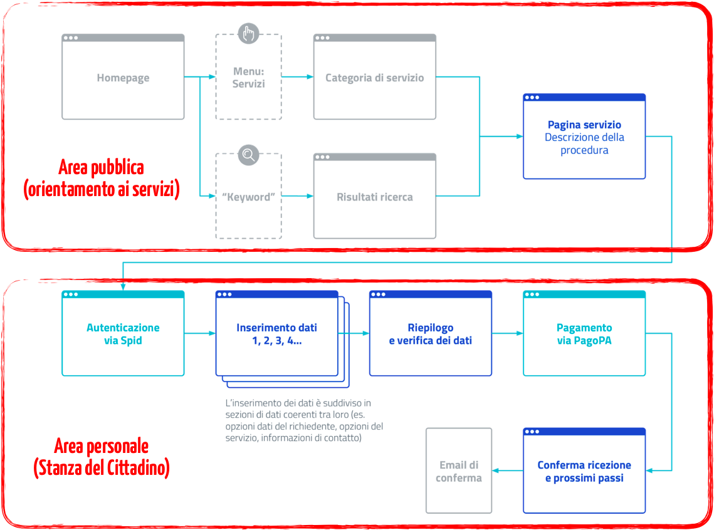

.. _h486b46417c1d3d2f5c67294434555b7f:

OpenCity
########

.. _h441757d86c261a2d5d6ad426f4033:

Normative di riferimento
########################

.. _h2c1d74277104e41780968148427e:

.. _h454cd2549294d3696220441d77b2e:

La piattaforma OpenCity
***********************

La \ |STYLE0|\ , sviluppata da Opencontent e rilasciata interamente con licenza Open Source, è già utilizzata da oltre 250 enti locali e società pubbliche per gestire i canali digitali di un ente pubblico; si tratta di uno strumento molto flessibile, esito di un’intensa attività di co-progettazione con amministratori locali, funzionari e dirigenti del settore pubblico, che permette di ripensare la comunicazione multi-canale con il cittadino e le modalità di progettazione dei servizi in una chiave innovativa, partecipativa, trasparente e moderna.

OpenCity rientra negli esempi virtuosi di adozione delle nuove \ |STYLE1|\  pubblicate da AgID:

        \ |STYLE2|\ 
        \ |LINK1|\ 

con particolare specializzazione sui siti web per i comuni:

        \ |STYLE3|\ 

        \ |LINK2|\ 

La piattaforma dispone di una serie di moduli indipendenti tra loro, ma interoperabili, chiamati anche “micro-servizi”\ [#F1]_\ , che vengono forniti in modalità As A Service (SaaS) e che possono essere attivati in tempi diversi a seconda delle priorità o delle necessità organizzative dell’ente che li adotta.

OpenCity rispetta la normativa vigente in materia di accessibilità dei siti web, oltre che le buone pratiche inerenti alla ottimizzazione per i motori di ricerca (SEO). Dal punto di vista della presentazione dei contenuti, la scelta è quella di utilizzare un design responsivo (che si adatta alla dimensione dello strumento utilizzato per navigare il sito) caratterizzato da un approccio di tipo mobile-first, che pone, cioè,  il focus sui dispositivi mobili.

Secondo le \ |STYLE4|\  ed il \ |STYLE5|\ , messi a punto dal Team per la Trasformazione Digitale, il sito web istituzionale dell’ente acquista una finalità completamente nuova, focalizzandosi sulla promozione dei servizi al cittadino e sull’erogazione dei servizi digitali. Il sito quindi si compone di due parti principali:

* un’\ |STYLE6|\ , tra le altre informazioni spicca la sezione dedicata ai “servizi pubblici”; la struttura ad albero del sito è prestabilita, caratterizzata da tipologie di contenuto standard

* un’\ |STYLE7|\ , all’interno della quale il cittadino che si autentica con SPID può prendere visione dei messaggi a lui riservati, delle pratiche in corso con il relativo stato di avanzamento, dei documenti che la PA decide di porre alla sua attenzione; a partire da quest’area, il cittadino può avviare le proprie istanze.

\ |IMG1|\ 

\ |STYLE8|\ 

.. _h69e1d2c43573664c7a405e2e6a4123:

Conformità alle Linee Guida AgID
********************************

OpenCity rispetta le seguenti linee guida definite da AgID (rese obbligatorie dall’art.71 del CAD):

* \ |STYLE9|\ 

* \ |STYLE10|\ 

* \ |STYLE11|\ 

* \ |STYLE12|\ 

* \ |STYLE13|\  - che include gli standard dell'informazione: ontologie e vocabolari controllati)

* \ |STYLE14|\  (in corso)

OpenCity e tutti i suoi moduli sono stati progettati ed implementati in modo tale da garantire la massima sostenibilità nel tempo. Infatti, per continuare ad essere utilizzate nel lungo termine e contribuire concretamente alla progressiva digitalizzazione dell’ente, i singoli micro-servizi devono necessariamente consentire benefici evidenti anche agli operatori interni, in termini di \ |STYLE15|\  (ad esempio, eliminando completamente il trasferimento manuale di dati); disponendo di dati puntualmente aggiornati, i responsabili dell’ente sono nella condizione di supervisionare l’attività degli stessi operatori interni, monitorare i flussi e pianificare eventuali ottimizzazioni dei processi.

I micro-servizi sono stati pensati come strumenti che facilitano il rispetto del quadro normativo relativo alla transizione digitale, fornendo al tempo stesso a tutti gli stakeholder coinvolti delle esperienze tangibili e concrete di applicazione delle norme e delle linee guida nazionali definite da AgID, peraltro facilmente riproducibili in ambiti diversi (cultura, servizi sociali, sanità, turismo, ...).

I singoli componenti tecnologici sono stati progettati secondo i principi definiti da:

* le \ |STYLE16|\  della Pubblica Amministrazione:
* \ |LINK3|\  inclusi i KIT di Designers Italia, ovvero l’insieme di risorse per progettare, realizzare e migliorare i servizi digitali della PA

* Le nuove \ |STYLE17|\  per le pubbliche amministrazioni:
* \ |LINK4|\ 

* Le \ |STYLE18|\ :
* \ |LINK5|\  che hanno caratterizzato lo sviluppo di un layer API oggi disponibili per tutte le applicazioni rilasciate; si veda ad esempio:
* \ |LINK6|\  tale componente può essere abilitata sia in lettura che in scrittura da back-office per qualsiasi tipologia di informazione, rendendo estremamente flessibile l’integrazione con software di terze parti, salvaguardando di conseguenza gli investimenti pregressi, valorizzando i fornitori già presenti (purché disponibili ad integrarsi)

* le indicazioni per l’adozione del \ |STYLE19|\ , utilizzando le metodologie contenute nel Cloud Enablement Kit elaborato dal Team Digitale:
* \ |LINK7|\  tale percorso ha favorito il processo di qualificazione dei principali strumenti implementati, che oggi possono essere forniti in modalità SaaS ed erogabili sul Cloud della PA:
* \ |LINK8|\  come previsto dai criteri stabiliti da AgID:
* \ |LINK9|\  \ |STYLE20|\ .

* le \ |STYLE21|\  (Open Data): \ |LINK10|\  che consentono l’alimentazione automatica dei portali regionali dedicati ai dati aperti, con dataset di elevata qualità generati automaticamente dai portali web degli enti locali; gli stessi dati sono disponibili via REST API.

Le azioni e le indicazioni contenute nel Piano Triennale per l’Informatica della PA e le varie Linee guida sopra citate non vengono intese solo come un mero adempimento normativo, ma come un insieme di indicazioni ragionevoli che favoriscono l’allineamento dei sistemi informativi della PA alle metodologie di progettazione, sviluppo ed utilizzo delle tecnologie digitali già largamente utilizzate in ambito ICT a livello internazionale, anche in ambito privato.

.. _h414d426f287354713d3c5c16327b:

Conformità al Piano Triennale per l’Informatica della PA
********************************************************

In pratica, realizzare e gestire un sito web istituzionale come quello sopra descritto consente di maturare un’esperienza concreta rispetto a molti dei punti che caratterizzano il Piano Triennale.

#. \ |STYLE22|\ 
#. I portali istituzionali, intesi come l’insieme di area pubblica ed area personale del cittadino, rappresentano uno strumento di abilitazione dei principi generali definiti dalla strategia nazionale, per le seguenti ragioni:

    #. ogni volta che viene censito un servizio nella fase di mappatura, si valuta se è possibile realizzarlo in digitale (come servizio on line), cogliendo l’occasione per rivedere le abitudini consolidate per abbreviare l’iter procedurale che deve essere seguito dai cittadini (\ |STYLE23|\ )

    #. per i servizi che vengono via via digitalizzati, vengono identificate le fonti primarie dell’informazione ed i registri di base che intervengono nello specifico iter on-line; tali fonti verranno progressivamente rese disponibili anche via API per evitare di chiedere più volte all’utente gli stessi dati (\ |STYLE24|\ )

    #. l’accesso ai servizi on-line (qualificazione dell’utente) avviene sempre attraverso SPID o sistemi analoghi (\ |STYLE25|\ )

    #. la piattaforma viene ospitata in cloud e predisposta per sfruttarne i benefici (scalabilità, continuità di servizio, sicurezza, ….), utilizzando esclusivamente soluzioni qualificate e presenti nel marketplace AgID; tutte le successive evoluzioni della stessa vengono progettate con le medesime caratteristiche e requisiti (\ |STYLE26|\ )

    #. la piattaforma è conforme ai requisiti di accessibilità previsti dalla normativa vigente e progressivamente allineata alle nuove linee guida per l’accessibilità, pubblicate a gennaio 2020 (\ |STYLE27|\ )

    #. la piattaforma è predisposta per il multilinguismo (\ |STYLE28|\ )

    #. vengono supportati diverse modalità per valorizzare i dati aperti, attraverso la rappresentazione e l’esportazione massiva dei dati in formato tabellare da parte dei cittadini (\ |STYLE29|\ )

    #. i dati personali vengono gestiti con politiche trasparenti all’utente e conformi a quanto previsto dalle direttive europee in termini di privacy e sicurezza (\ |STYLE30|\ )

    #. la piattaforma mette a disposizione un layer di API che consente di interfacciarsi facilmente con applicazioni di back-office (\ |STYLE31|\ )

    #. tutti i componenti sono rilasciati in open source e pubblicati sul portale nazionale del riuso (Developers Italia); risultano inoltre interoperabili a vari livelli. Queste due caratteristiche consentono a soggetti terzi di interagire con la piattaforma e di sviluppare il proprio modello di business: consulenza sulle medesime soluzioni tecnologiche in altre aree geografiche del paese, integrare soluzioni anche proprietarie via API, ecc. (\ |STYLE32|\ )

    #. la piattaforma ed i suoi moduli sono predisposti per l’interoperabilità, mettendo a disposizione un layer di API per dialogare con soluzioni esterne (\ |STYLE33|\ )

    #. una delle principali ragioni per cui è stata progettata la Stanza del Cittadino è quella di fornire servizi digitali moderni ed innovativi a cittadini ed imprese (\ |STYLE34|\ )

    #. la piattaforma e tutti i suoi moduli sono progettati per erogare servizi attraverso smartphone e tablet (\ |STYLE35|\ )

    #. tutte le informazioni gestite dalla piattaforma vengono strutturate e definite attraverso un modello semantico standard (\ |STYLE36|\ )

#. \ |STYLE37|\ 
#. La piattaforma risulta conforme ai seguenti riferimenti normativi:

    #. Nazionali:

        #. Codice dell’Amministrazione Digitale, in particolare per gli articoli 3 (SPID), 5 (PagoPA), 7 (diritto degli utenti a servizi online semplici e integrati), 64 e 65 (istanze on-line), 68 e 69 (Open Source e riuso)

        #. Linee Guida su acquisizione e riuso di software nella PA

        #. Cloud della PA

        #. Linee Guida di design per i servizi digitali della PA

        #. Modello di interoperabilità

        #. Direttiva PSI (Open Data)

    #. Europei:

        #. EIF - European Interoperability Framework

        #. Regolamento europeo 2018/1724 del 2 ottobre 2018 che istituisce uno sportello digitale unico per l’accesso a informazioni, procedure e servizi di assistenza e di risoluzione dei problemi e che modifica il regolamento (UE) n. 1024/2012 - “Single Digital Gateway”

        #. Direttiva EU 2016/2102 relativa all’accessibilità dei siti web e delle applicazioni mobili degli enti pubblici

#. \ |STYLE38|\ 
#. La piattaforma potrà essere ospitata nel Cloud, secondo la formula del Software as a Service (SaaS). Il Cloud computing è un modello flessibile ed economico per la fornitura di servizi ICT che consente un accesso più agevole a risorse configurabili e condivise, grazie a tecnologie basate su internet. Per il raggiungimento di tali obiettivi, AgID ha previsto una specifica procedura di qualificazione di soluzioni di “Software as a Service” (SaaS) nell’ambito della strategia di evoluzione del modello Cloud della PA ripreso dal Piano Triennale. Il modello SaaS rappresenta un modello di distribuzione in cui il software viene gestito in modo centralizzato e reso disponibile agli Enti sulla base di una sottoscrizione (che si traduce in un canone annuale).

#. \ |STYLE39|\ 
#. Il rispetto degli standard definiti a livello nazionale (AgID/OntoPiA) ed europeo (Core Vocabularies) consente ai fornitori di software terze parti di abbattere i costi delle integrazioni e favorisce la nascita di nuove applicazioni a valore aggiunto basate sul riuso dei dati aperti. Tutti i siti e le applicazioni web sviluppate dispongono di una console, utilizzabile da qualsiasi sviluppatore, che consente di interrogare il database alimentato dal CMS Headless.
#. La strutturazione delle informazioni segue i nuovi standard nazionali definiti da AgID e dall’iniziativa ISA² (Interoperability solutions for public administrations, businesses and citizens) della Commissione Europea; su questo:

    #. il 24 settembre 2019, lo standard italiano per gli eventi (CPEV-AP_IT), già utilizzato in OpenAgenda, è stati proposti da AgID nell’ambito dell’iniziativa ISA², affinché diventino patrimonio condiviso in ambito EU

    #. il 27 settembre 2019 siamo stati citati come caso studio nazionale per l'uso dello standard sui servizi (CPSV):
    #. \ |LINK11|\  e nel rapporto "APIs for CPSV-AP based Catalogue of Services":
    #. \ |LINK12|\ 

#. \ |STYLE40|\ 
#. L’attenzione all’architettura delle informazioni gestite dalla più recente versione di OpenCity consente di:

    #. generare un archivio di informazioni costantemente aggiornate, codificate in formato \ |STYLE41|\ , che possono essere riusate per alimentare le varie sezioni del sito web e che costituiscono la fonte primaria della comunicazione multicanale dell’ente; questo aspetto garantisce un notevole risparmio di tempo per il personale interno ed aumenta esponenzialmente la qualità dei dati gestiti

    #. rendere ogni sezione del sito interoperabile via API per qualsiasi tipologia di contenuto (personale, luoghi, atti, servizi, eventi, ...); dal punto di vista architetturale, questa componente consente un effettivo disaccoppiamento dei sistemi applicativi adottati dall’ente locale (netta separazione tra gli ambienti di back-end e di front-end), nonché di adottare un unico ambiente sicuro per la gestione delle informazioni pubbliche (CMS Headless), caratterizzato da policy predefinite, e di visualizzare informazioni perfettamente coerenti tra loro su più canali digitali (sito web, APP, totem, ecc...)

    #. strutturare nativamente l'informazione secondo modelli dati standard e vocabolari controllati; questo punto, nel caso dei portali e dei servizi web, rappresenta una condizione abilitante per favorire l’interoperabilità semantica, come descritto al punto precedente

    #. rilasciare i dati in forma aperta - Open Data; i dati strutturati alimentano contemporaneamente sia le interfacce html, dunque le pagine del sito web, sia un end-point (REST API) che espone i dati in formati come JSON, CSV, XML; gli end-point così generati costituiscono i dataset che, corredati da opportuni metadati, rendono disponibili i dati secondo il paradigma Open Data. Per facilitarne l’esposizione, il CMS è dotato di una funzione che genera automaticamente i metadati richiesti dallo standard nazionale DCAT-AP_IT per ciascun dataset; l’intero pacchetto informativo viene poi pubblicato automaticamente sul portale CKAN provinciale dedicato agli Open Data

    #. alimentare automaticamente ed in tempo reale una piattaforma centrale che raccoglie dati; tale funzione consente agli utenti finali (anche cittadini) di configurare dei widget che espongono i dati generati a livello locale attraverso mappe geografiche, grafici interattivi ed altre rappresentazioni che agevolano la lettura dei dati; tale abilitazione consente di arricchire le pagine dei siti web o di generare delle dashboard per i decision maker degli enti locali (che possono così prendere decisioni supportate dai dati), abbattendo i costi di sviluppo di ulteriori tool personalizzati per ogni ente

#. \ |STYLE42|\ 
#. La piattaforma si integra già con SPID e PagoPA.

#. \ |STYLE43|\ 
#. La piattaforma, una volta resa disponibile anche alle strutture provinciali, può contribuire allo sviluppo degli ecosistemi definiti a livello nazionale per lo meno quello della cultura e quello della famiglia, rendendo disponibile la stessa tecnologia a tutti gli stakeholder locali coinvolti.

#. \ |STYLE44|\ 
#. La piattaforma è progettata secondo gli standard di sicurezza previsti dalla normativa vigente e viene costantemente aggiornata per mantenerne la conformità.

#. \ |STYLE45|\ 
#. La piattaforma adotta i KIT definiti da Designers Italia ed implementa Bootstrap Italia in tutte le sue parti, un'interfaccia web responsive, usabile, accessibile, conforme alle linee guida di design dei servizi per la PA.

.. _h675e4b522c7a97d13a24b62124f42:

Conformità al GDPR (Regolamento UE 2016/679)
********************************************

\ |STYLE46|\ 

La piattaforma OpenCity è stata sviluppata nel rispetto dei principi di protezione dei dati personali, conformemente a quanto previsto dal Regolamento UE 2016/679 - Regolamento generale per la protezione dei dati personali (GDPR) (di seguito “Regolamento”) e dalla normativa nazionale di riferimento (D.Lgs. 196/2003 così come riformato dal D.Lgs. 101/2018), integrando le funzionalità e gli accorgimenti di seguito descritti.

La sicurezza del sistema finalizzata alla prevenzione di accessi illeciti si basa su una metodologia di assegnazione granulare dei profili autorizzativi, mediante l’attivazione di permessi di operatività limitata a quanto strettamente indispensabile in base alla tipologia di utente.

Il sistema traccia mediante log, le operazioni che i singoli utenti eseguono sui dati (inserimento, modifica e pubblicazione dei dati).

Nei servizi che prevedono la registrazione utente o la modifica di password (es. OpenNewsletter, OpenAgenda, SpaziComuni, ...), il sistema verifica l’adeguatezza del livello di sicurezza della password scelta, avvisando l’utente con un messaggio.

Il sistema prevede che i dati siano visibili a tutti i visitatori del sito solo se collocati nella sezione “pubblica”, mediante la funzionalità di pubblicazione.

Al fine di limitare gli errori dell’utente in fase di alimentazione della piattaforma è previsto un sistema di content model orientato alla strutturazione dei dati.

Il sistema implementa nativamente un meccanismo di gestione granulare dei permessi, che consente di definire dei ruoli, in cui vengono create le policy d’uso di ogni singola funzionalità dell’applicazione, e di assegnarle a gruppi di utenti. Il livello di amministratore generale è riservato all’amministratore di sistema.

Per la mitigazione dei rischi declinati in termini di confidenzialità, integrità e disponibilità dei dati, sono state adottate le seguenti misure:

* rischio di perdita di confidenzialità derivante da illecita diffusione mediante pubblicazione accidentale: al fine di incrementare il livello di consapevolezza ed intenzionalità dell’utente che esegue le operazioni di pubblicazione è stato attivata una modalità operativa che richiede una conferma esplicita dell’utente prima di rendere visibile il dato

* Rischio di perdita di disponibilità derivante da cancellazione accidentale del dato: al fine di incrementare il livello di consapevolezza ed intenzionalità dell’utente che esegue le operazioni di cancellazione è stata attivata una modalità operativa che richiede la conferma esplicita dell’utente prima di eseguire il comando di cancellazione

* Rischio di perdita di disponibilità per guasto ai supporti di memorizzazione: sono configurati backup giornalieri

E’ stato predisposto un apposito documento con indicazione dettagliata delle misure tecniche di sicurezza individuate a mitigazione dei rischi.

Al fine di garantire il rispetto del principio di limitazione della conservazione (art. 5 par. 1 lett. e) il tempo di conservazione dei dati personali raccolti e trattati dalla piattaforma è stato individuato in 24 mesi. Viene attivata una funzionalità che provvede automaticamente alla verifica del periodo di conservazione e all’attivazione delle operazioni di cancellazione.

Il costante monitoraggio della sicurezza dei sistemi è garantito dalla configurazione di funzionalità di alert attivati ad evento; gli eventi principali sono: indisponibilità delle pagine web in cui devono comparire i dati; problemi di connessione tra le componenti software del sistema; problemi di connessione ad internet; carichi anomali sull’infrastruttura, che possono compromettere la corretta erogazione del servizio.

Come previsto dal generale principio di accountability e in particolare dagli artt. 29 e 32, il personale di Opencontent è stato formato e formalmente autorizzato alle attività di trattamento. Al fine di supportare e documentare le istruzioni operative ricevute dal personale, sono state predisposte varie procedure per la gestione dei processi aziendali (gestione data breach, cancellazione dei dati).

I fornitori esterni che eseguono attività di trattamento per conto di Opencontent, scelti in base alle caratteristiche che permettano la messa in opera di adeguate garanzie di rispetto del Regolamento, sono stati formalmente nominati mediante apposito atto giuridico con specifica indicazione delle istruzioni per il trattamento dei dati. 

Al fine di supportare l’Ente per il rispetto degli articoli 13 e 14 del Regolamento, nonché il generale principio di trasparenza (art. 5 par. 1 lett. a) è stata predisposta una funzionalità che all’attivazione del sistema predispone l’apposito spazio per la collocazione della privacy policy. Inoltre, qualora il Titolare del trattamento, identifichi trattamenti la cui base giuridica è da individuarsi nel consenso (art. 6 par. 1 lett. a), art. 9 par. 2 lett. a), la piattaforma prevede l’attivazione di apposita sessione per la raccolta del/dei consenso/i per ogni attività di trattamento che lo richiede.

Le categorie di trattamento derivanti dalle funzionalità della piattaforma, sono censite nel registro di trattamenti del responsabile del trattamento (art. 30 del Regolamento): Opencontent infatti agisce in qualità di responsabile del trattamento (art. 28 del Regolamento). All’interno del registro dei trattamenti sono stati inseriti i parametri di valutazione finalizzati alla verifica puntuale della necessità di effettuare eventuali valutazioni di impatto (art. 35 del Regolamento e Linee guida WP248).

Alla disattivazione del sistema, i dati personali vengono esportati e consegnati all’ente. Opencontent provvede alla cancellazione sicura dei dati, rilasciando apposita dichiarazione a conclusione dell’operazione.

.. bottom of content

.. |STYLE0| replace:: **piattaforma OpenCity**

.. |STYLE1| replace:: **Linee Guida di design per i servizi web della PA (versione 2019.2)**

.. |STYLE2| replace:: *Esempi di Pubbliche Amministrazioni virtuose, che hanno scelto di adottare le linee guida e di condividere il codice sorgente utilizzato per la realizzazione dei propri siti così come previsto dall’art. 69 del Codice dell’Amministrazione Digitale:*

.. |STYLE3| replace:: *Design dei siti web dei Comuni italiani*

.. |STYLE4| replace:: **nuove Linee Guida di design per i servizi web della PA (versione 2019.2)**

.. |STYLE5| replace:: **KIT per i comuni**

.. |STYLE6| replace:: **area pubblica**

.. |STYLE7| replace:: **area personale**

.. |STYLE8| replace:: *Il percorso del cittadino, secondo il design pattern definito dal Team Digitale*

.. |STYLE9| replace:: **Riuso e open source**

.. |STYLE10| replace:: **Cloud della PA**

.. |STYLE11| replace:: **Modello di interoperabilità**

.. |STYLE12| replace:: **Open Data e PSI**

.. |STYLE13| replace:: **Designers Italia**

.. |STYLE14| replace:: **Accessibilità**

.. |STYLE15| replace:: **risparmio di tempo, automazione dei processi, contenimento della spesa, integrità dei dati gestiti**

.. |STYLE16| replace:: **Linee Guida di design per i servizi web**

.. |STYLE17| replace:: **Linee guida su acquisizione e riuso di software**

.. |STYLE18| replace:: **Linee Guida relative al modello di interoperabilità**

.. |STYLE19| replace:: **modello cloud computing nella PA**

.. |STYLE20| replace:: **dal 1 aprile 2019 le PA non possono acquistare servizi in cloud non presenti nel marketplace**

.. |STYLE21| replace:: **Linee Guida per la valorizzazione del patrimonio informativo pubblico**

.. |STYLE22| replace:: **Strategia per la trasformazione digitale**

.. |STYLE23| replace:: *digital by default*

.. |STYLE24| replace:: *once only*

.. |STYLE25| replace:: *digital identity only*

.. |STYLE26| replace:: *cloud first*

.. |STYLE27| replace:: *inclusività e accessibilità dei servizi*

.. |STYLE28| replace:: *inclusività territoriale*

.. |STYLE29| replace:: *apertura e trasparenza dei dati*

.. |STYLE30| replace:: *fiducia e sicurezza*

.. |STYLE31| replace:: *multi-layer architecture*

.. |STYLE32| replace:: *ridurre i costi e migliorare la qualità dei servizi*

.. |STYLE33| replace:: *API economy*

.. |STYLE34| replace:: *priorità ai servizi di front end*

.. |STYLE35| replace:: *mobile first*

.. |STYLE36| replace:: *abilitare politiche data-driven*

.. |STYLE37| replace:: **Contesto normativo digitale nazionale ed europeo**

.. |STYLE38| replace:: **Infrastrutture (Cloud della PA)**

.. |STYLE39| replace:: **Modello di interoperabilità (standard nazionali ed europei)**

.. |STYLE40| replace:: **Dati della PA**

.. |STYLE41| replace:: *machine-readable*

.. |STYLE42| replace:: **Piattaforme abilitanti**

.. |STYLE43| replace:: **Ecosistemi**

.. |STYLE44| replace:: **Sicurezza informatica**

.. |STYLE45| replace:: **Strumenti per la gestione e la diffusione dei servizi digitali**

.. |STYLE46| replace:: *(N.B.: questa dichiarazione è stata inviata ad AgID per la qualificazione al marketplace dei servizi SaaS)*

.. |LINK1| raw:: html

    <a href="https://italia.github.io/design-comuni-prototipi/it/esempi.html" target="_blank">https://italia.github.io/design-comuni-prototipi/it/esempi.html</a>

.. |LINK2| raw:: html

    <a href="https://docs.italia.it/italia/designers-italia/design-comuni-docs/it/stabile/" target="_blank">https://docs.italia.it/italia/designers-italia/design-comuni-docs/it/stabile/</a>

.. |LINK3| raw:: html

    <a href="https://docs.italia.it/italia/designers-italia/design-linee-guida-docs/it/stabile/" target="_blank">https://docs.italia.it/italia/designers-italia/design-linee-guida-docs/it/stabile/</a>

.. |LINK4| raw:: html

    <a href="https://docs.italia.it/italia/developers-italia/lg-acquisizione-e-riuso-software-per-pa-docs/it/stabile/" target="_blank">https://docs.italia.it/italia/developers-italia/lg-acquisizione-e-riuso-software-per-pa-docs/it/stabile/</a>

.. |LINK5| raw:: html

    <a href="https://docs.italia.it/italia/piano-triennale-ict/lg-modellointeroperabilita-docs/" target="_blank">https://docs.italia.it/italia/piano-triennale-ict/lg-modellointeroperabilita-docs/</a>

.. |LINK6| raw:: html

    <a href="https://documenter.getpostman.com/view/7046499/S17tPncG?version=latest" target="_blank">https://documenter.getpostman.com/view/7046499/S17tPncG?version=latest</a>

.. |LINK7| raw:: html

    <a href="https://cloud.italia.it/it/cloud-enablement/" target="_blank">https://cloud.italia.it/it/cloud-enablement/</a>

.. |LINK8| raw:: html

    <a href="https://cloud.italia.it/marketplace/supplier/market/index_SaaS.html" target="_blank">https://cloud.italia.it/marketplace/supplier/market/index_SaaS.html</a>

.. |LINK9| raw:: html

    <a href="https://cloud-italia.readthedocs.io/projects/cloud-italia-circolari/it/latest/circolari/SaaS/" target="_blank">https://cloud-italia.readthedocs.io/projects/cloud-italia-circolari/it/latest/circolari/SaaS/</a>

.. |LINK10| raw:: html

    <a href="https://docs.italia.it/italia/daf/lg-patrimonio-pubblico/it/stabile/" target="_blank">https://docs.italia.it/italia/daf/lg-patrimonio-pubblico/it/stabile/</a>

.. |LINK11| raw:: html

    <a href="https://joinup.ec.europa.eu/solution/core-public-service-vocabulary-application-profile/about#what" target="_blank">https://joinup.ec.europa.eu/solution/core-public-service-vocabulary-application-profile/about#what</a>

.. |LINK12| raw:: html

    <a href="https://joinup.ec.europa.eu/sites/default/files/news/2019-09/ISA2_APIs%20for%20CPSV-AP%20based%20Catalogue%20of%20Services_0.pdf" target="_blank">https://joinup.ec.europa.eu/sites/default/files/news/2019-09/ISA2_APIs%20for%20CPSV-AP%20based%20Catalogue%20of%20Services_0.pdf</a>

.. rubric:: Footnotes

.. [#f1]  L’architettura micro-servizi è un approccio indirizzato allo sviluppo di applicazioni autonome e interconnesse, che implementano una singola funzionalità svolgendo una funzione specifica. Questo rende il prodotto in grado di far fronte a esigenze numerose e differenti, rimanendo orientato ai servizi ed alle esigenze dei fruitori: i cittadini.  

